# Master Suite — Architecture & Network Configuration Assessment

**Revision 3 · 2026-08-22 · commit `07d39c8`**

> **A third assessment, not an update of the first two.**
> `ARCHITECTURE-NETWORK-ASSESSMENT.md` records `aede392` and
> `ARCHITECTURE-NETWORK-ASSESSMENT-R2.md` records `f1dd84e`. Both are left as
> written, for the reason each of them gives: an assessment that edits itself is
> no longer a record of anything. This document reads the tree as it stands at
> `07d39c8`, twenty-five commits after R2, and reaches different conclusions
> about several things R2 rated High.

**Method.** Everything below was read out of the codebase, measured against a
live PostgreSQL 16 catalog with all 58 migrations applied, taken from a rendered
Compose configuration, or observed by running the application and driving it in
a browser. Where something cannot be determined from the repository it is marked
**UNKNOWN / NOT FOUND** rather than inferred. **No credential value appears
anywhere in this document**; where a secret's handling is discussed, only its
location and its risk are named.

**Nothing in this document redesigns the product.** Section 20's "future
architecture" is confined to resolving problems identified in sections 1–19.

---

## Executive summary

Master Suite is **one Next.js 16.2.12 application** — not a frontend and a
backend, one deployable that server-renders its own pages and serves its own
API. 131,420 lines of TypeScript across 756 files, with a second process of the
same image draining nine BullMQ queues and a 729-line Python sidecar doing face
recognition. One PostgreSQL 16 database holds 197 models — 198 tables — for
every tenant.

**Every P0, P1 and P2 revision 2 raised is closed.** Of its seven P3 items, one
is closed, one was removed, and five are framework-blocked, conditional on
something that has not happened, or explicitly opportunistic.

The headline has moved twice. R1's was a worker container that could not start,
so every queue went unconsumed in silence. R2's was a complete instrumentation
layer with nothing scraping it. **R3's is that there is no longer a technical
headline** — what limits this system is a single virtual machine and four
product decisions nobody has made. Both are outside an implementer's authority,
and neither is a defect.

Tenant isolation, the property this product cannot be partly right about, was
audited invariant by invariant for this revision rather than sampled. **No live
cross-tenant read or write exists.** Four dormant exemptions were found and
closed, and two CI gates now check the exemption lists against the schema and
the catalog, so the class cannot silently return.

**Overall production readiness: 84 / 100** (R2: 73 · R1: 46).

---

## Technology stack

Read from `apps/web/package.json`, `prisma/schema.prisma` and the Compose files.
Nothing here is inferred from documentation.

| Layer         | Technology                                    | Version               | Evidence                               |
| ------------- | --------------------------------------------- | --------------------- | -------------------------------------- |
| Runtime       | Node.js                                       | 22 (`node:22-alpine`) | `infra/Dockerfile`                     |
| Framework     | Next.js App Router, `output: 'standalone'`    | 16.2.12               | `package.json`, `next.config.ts:23`    |
| UI            | React / React DOM                             | 19                    | `package.json`                         |
| Styling       | Tailwind CSS + PostCSS                        | 4.0                   | `@tailwindcss/postcss`, `src/styles/`  |
| Charts        | Recharts                                      | 2.14                  | `package.json`                         |
| Maps          | Leaflet                                       | 1.9                   | used by site-visit / geofence screens  |
| ORM           | Prisma + `@prisma/adapter-pg`                 | 7.0                   | `src/lib/db.ts`                        |
| Database      | PostgreSQL                                    | 16                    | Compose `postgres:16`, live catalog    |
| Cache / queue | Redis via ioredis; BullMQ                     | 5.4 / 5.34            | `src/lib/redis.ts`, `src/lib/queue.ts` |
| Object store  | AWS SDK v3 S3 client against MinIO            | 3.700                 | `src/lib/storage.ts`                   |
| Validation    | Zod                                           | 3.24                  | every route contract                   |
| Passwords     | `@node-rs/argon2` (Argon2id)                  | 2.0                   | `src/lib/auth/password.ts`             |
| Logging       | pino                                          | 9.5                   | `src/lib/logger.ts`                    |
| Mail          | nodemailer                                    | 9.0                   | `src/lib/mailer.ts`                    |
| Ids           | ULID (request ids, object keys) + cuid (rows) | 2.3                   | `src/lib/api/handler.ts`               |
| Edge          | Caddy 2 (automatic TLS)                       | `caddy:2-alpine`      | `infra/Caddyfile`                      |
| Monitoring    | Prometheus + Alertmanager                     | Compose images        | `infra/docker-compose.yml`             |
| Sidecar       | Python face-recognition service               | —                     | `apps/face/`, 5 files / 729 lines      |
| Tests         | Vitest + Playwright                           | 4.1 / 1.51            | 1,538 unit+integration, 11 e2e specs   |

**Not present, and worth stating because a reader may expect them:** no GraphQL,
no tRPC, no Redux/Zustand/Jotai, no ORM other than Prisma, no message broker
other than Redis, no Kubernetes manifests, no Terraform/Pulumi/Bicep/ARM, no
payment provider, no feature-flag service, no APM or error-reporting SDK.

---

## 1. Current system architecture

### 1.1 The shape of it

One process serves the browser and the API. A second process of the **same
image** runs the queue consumers. Everything else is infrastructure.

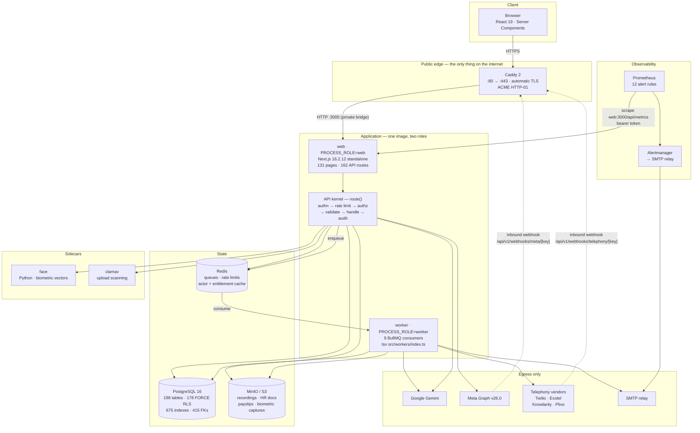

### 1.2 How the components communicate

| From → To           | Mechanism                                         | Notes                                                                    |
| ------------------- | ------------------------------------------------- | ------------------------------------------------------------------------ |
| Browser → web       | HTTPS to Caddy, then HTTP on the Compose bridge   | Server Components render server-side; client components call `/api/v1/*` |
| web → PostgreSQL    | Prisma 7 over `@prisma/adapter-pg`, pooled        | Every query passes the tenant-guard extension in `src/lib/db.ts`         |
| web → Redis         | ioredis, single shared client on `globalThis`     | `lazyConnect: true` so a build does not open sockets                     |
| web → worker        | BullMQ job enqueued onto Redis                    | No direct process-to-process call exists                                 |
| web/worker → S3     | AWS SDK v3, `forcePathStyle`, `S3_ENDPOINT`       | Keys are `t-${tenantId}/…` prefixed                                      |
| web → face sidecar  | HTTP + bearer token, constant-time compared       | `FACE_SERVICE_URL`, timeout `FACE_SERVICE_TIMEOUT_MS`                    |
| web → clamav        | TCP INSTREAM to `CLAMAV_HOST:CLAMAV_PORT`         | Upload path only                                                         |
| web/worker → Gemini | HTTPS REST, per-tenant key or deployment fallback | Redacted at the boundary                                                 |
| Vendor → app        | Inbound webhook through Caddy, keyed URL          | Rate-limited _by key before the key is looked up_                        |
| Prometheus → web    | HTTP scrape on the private bridge, bearer token   | Caddy 404s `/api/metrics` from outside                                   |

### 1.3 Subsystem inventory

| Concern         | Implementation                                             | Location                                                   |
| --------------- | ---------------------------------------------------------- | ---------------------------------------------------------- |
| Frontend        | Next App Router, Server Components by default              | `src/app/(workspace)`, `(platform)`, `(auth)`              |
| Backend         | Route handlers behind one kernel                           | `src/lib/api/handler.ts`                                   |
| API             | REST, versioned `/api/v1`, Zod-validated                   | 162 route files, 102 groups                                |
| Database        | Shared database / shared schema, `tenantId` column         | `prisma/schema.prisma`                                     |
| Authentication  | Opaque session token in an httpOnly cookie; API keys       | `src/lib/auth/session.ts`, `apiKey.ts`                     |
| Authorization   | Scoped RBAC — `module:ACTION` → scope                      | `src/lib/security/rbac.ts`, `visibility.ts`                |
| Multi-tenancy   | Three layers: kernel, Prisma guard, FORCE RLS              | `src/lib/db.ts` + 178 policies                             |
| Storage         | S3 API, tenant-prefixed keys                               | `src/lib/storage.ts`                                       |
| Background jobs | BullMQ, 9 queues, 9 consumers                              | `src/lib/queue.ts`, `src/workers/`                         |
| AI              | Google Gemini, redacted, metered, capped                   | `src/lib/ai/`                                              |
| Integrations    | Telephony ×4, Meta WhatsApp, Google, transcription         | `src/lib/integrations/`                                    |
| Notifications   | In-app rows + email via the `notifications` queue          | `src/services/engagement/`, `src/workers/notifications.ts` |
| Logging         | pino structured JSON to stdout, request-id carried         | `src/lib/logger.ts`                                        |
| Monitoring      | Prometheus exposition, 16 series, 12 rules                 | `src/app/api/metrics/route.ts`                             |
| Audit trail     | `AuditLog` (tenant) + `PlatformAuditEvent` (control plane) | `src/lib/security/audit.ts`                                |
| Configuration   | Zod-validated env, 62 variables, `<KEY>_FILE` indirection  | `src/lib/env.ts`                                           |
| Secrets         | Generated per environment, never committed                 | `scripts/generate-secrets.mjs`                             |
| Error handling  | Typed `AppError` hierarchy, mapped to HTTP by the kernel   | `src/lib/errors.ts`                                        |
| Caching         | Redis: actor permissions (versioned), entitlements         | `src/lib/auth/actorCache.ts`, `security/entitlements.ts`   |
| Sessions        | `PlatformSession` rows, sha256-hashed tokens, rotation     | `src/lib/auth/session.ts`                                  |

---

## 2. Application component map

### Frontend

| Component         | Purpose                                           | Location                                   | Deps              | Auth                          | Production-ready | Limitations                                       |
| ----------------- | ------------------------------------------------- | ------------------------------------------ | ----------------- | ----------------------------- | ---------------- | ------------------------------------------------- |
| Workspace shell   | Signed-in CRM/HR surface, nav, workspace switcher | `src/app/(workspace)`                      | Prisma, RBAC      | Session                       | ✅               | 92 of 111 pages query Prisma directly (W-1 below) |
| Platform console  | Cross-tenant operator surface                     | `src/app/(platform)`                       | `platform-access` | Session + platform role + MFA | ✅               | Break-glass grants are time-boxed and reasoned    |
| Auth screens      | Login, reset, invitation, 2FA enrolment           | `src/app/(auth)`                           | `auth/*`          | Anonymous                     | ✅               | —                                                 |
| Public capture    | Forms, RSVP, testimonial                          | `src/app/f`, `/l`, `/rsvp`, `/testimonial` | `publicLink`      | **Anonymous**                 | ✅               | Rate-limited per IP                               |
| Shared components | Grid, filters, forms, charts                      | `src/components`                           | Recharts, Leaflet | —                             | ✅               | —                                                 |

### Backend

| Component            | Purpose                                                | Location                            | Notes                                                   |
| -------------------- | ------------------------------------------------------ | ----------------------------------- | ------------------------------------------------------- |
| API kernel `route()` | The single entry point; enforces the security contract | `src/lib/api/handler.ts`            | A route not going through it is a review blocker        |
| Guarded streaming    | Downloads that return their own `Response`             | `src/lib/api/guarded.ts`            | Exists so a download need not re-implement the prologue |
| Services layer       | Business logic, 21 domains                             | `src/services/*`                    | `leads`, `opportunities`, `dialer`, `hr`, `platform`, … |
| Tenant guard         | Prisma client extension                                | `src/lib/db.ts`                     | Refuses an unscoped model query                         |
| RBAC                 | Scope resolution and assertion                         | `src/lib/security/rbac.ts`          | 6 scopes, `module:ACTION` map                           |
| Visibility           | Turns a scope into a `where` clause                    | `src/lib/security/visibility.ts`    | OWN/TEAM/BRANCH/REGION/ORGANIZATION                     |
| Field security       | Per-field read/write masking                           | `src/lib/security/fieldSecurity.ts` | `FIELD_MAP`                                             |
| Rate limiting        | Redis fixed-window counters                            | `src/lib/security/ratelimit.ts`     | Named limits, unforgettable — in the route contract     |
| Entitlements         | Per-tenant product-module gating                       | `src/lib/security/entitlements.ts`  | Cached, versioned                                       |
| Audit                | Tenant and platform audit writes                       | `src/lib/security/audit.ts`         | `SECRET_KEYS` scrubbed                                  |
| Envelope encryption  | Field-level encryption at rest                         | `src/lib/security/envelope.ts`      | `FIELD_ENCRYPTION_KEY`                                  |
| Outbound URL guard   | SSRF allow-list                                        | `src/lib/security/outboundUrl.ts`   | `RECORDING_URL_ALLOWED_HOSTS`                           |
| Queue                | 9 typed queues, retry policy per queue                 | `src/lib/queue.ts`                  | Exhaustive both directions                              |
| Queue fairness       | Per-tenant concurrency ceiling                         | `src/lib/queueFairness.ts`          | `q:slots:<queue>:<tenant>`                              |
| Retention            | Daily sweep across 8 record classes                    | `src/lib/jobs/retention.ts`         | Runs under `withPlatformTx`                             |
| Startup check        | Refuses to serve a misconfiguration                    | `src/lib/startup-check.ts`          | Verifies the role cannot bypass RLS                     |

### Database

| Component       | Detail                                                                                        |
| --------------- | --------------------------------------------------------------------------------------------- |
| Engine          | PostgreSQL 16, one database, one schema (`public`)                                            |
| Models / tables | 197 Prisma models · 198 tables · 105 enums                                                    |
| Indexes / FKs   | 675 / 415                                                                                     |
| Isolation       | 178 tables `FORCE ROW LEVEL SECURITY`, 178 policies                                           |
| Migrations      | 58, ledger at head, drift-gated in CI                                                         |
| Roles           | `DATABASE_URL` = NOBYPASSRLS app role with `CREATE` revoked; `MIGRATION_DATABASE_URL` = owner |
| Replica         | `DATABASE_REPLICA_URL` → `prismaRead`, used by reports and exports                            |

### AI

| Component       | Location                                   | Notes                                                                             |
| --------------- | ------------------------------------------ | --------------------------------------------------------------------------------- |
| Gemini client   | `src/lib/ai/gemini.ts`                     | Per-tenant key, deployment fallback, `GEMINI_MODEL` default `gemini-flash-latest` |
| Redaction       | `src/lib/ai/redact.ts`                     | SECRET · EMAIL · CARD · PHONE · NUMBER, including spoken digit sequences          |
| Call analysis   | `src/lib/ai/analysis.ts`, `callMetrics.ts` | Schema-constrained output                                                         |
| Assistant       | `src/lib/ai/assistant/`                    | Tools run the caller's own permissions                                            |
| Live coach      | `src/lib/ai/liveCoach.ts`                  | In-call prompting                                                                 |
| Practice        | `src/lib/ai/practice.ts`                   | Role-play training                                                                |
| Follow-up email | `src/lib/ai/followUpEmail.ts`              | Drafts, never auto-sends                                                          |
| Metering        | `src/lib/ai/usage.ts`                      | `WorkspaceUsage` metric `ai_tokens:YYYY-MM`, plan limit `ai_tokens_monthly`       |
| Simulation      | `src/lib/ai/simulated.ts`                  | Honest, labelled — chosen when no key is configured                               |

### Infrastructure

| Component         | Location                                               | Notes                                         |
| ----------------- | ------------------------------------------------------ | --------------------------------------------- |
| Compose base      | `infra/docker-compose.yml`                             | 10 services, loopback-published               |
| Overlays          | `dev`, `prod`, `staging`, `azure`, `pgbouncer`         | `!reset`/`!override` layering, Compose ≥ 2.24 |
| Edge              | `infra/Caddyfile`, `Caddyfile.staging`                 | ACME, 32 MB body cap, `/api/metrics` → 404    |
| Host provisioning | `infra/provision-host.sh`, `cloud-init.yaml`           | Idempotent, check-only mode                   |
| Systemd           | `infra/systemd/` × 6 units                             | backup, restore-verify, backup-status         |
| Monitoring        | `prometheus.yml`, `prometheus-alerts.yml`, entrypoints | Config rendered into tmpfs                    |

### External integrations

See §14.

### Security

`rbac.ts` · `visibility.ts` · `fieldSecurity.ts` · `ratelimit.ts` · `audit.ts` ·
`entitlements.ts` · `envelope.ts` · `outboundUrl.ts` · `cidr.ts` ·
`auth/mfa.ts` · `auth/password.ts` · `auth/platform-access.ts` ·
`auth/support-actor.ts` · `startup-check.ts`.

### Administration

Platform console (`src/app/(platform)`), `src/services/platform/*`,
`scripts/bootstrap-owner.mjs`, `scripts/owner-mfa.mjs`, break-glass grants
(`PlatformAccessGrant`), and the control-plane audit trail
(`PlatformAuditEvent`).

---

## 3. Frontend architecture

**Framework** Next.js 16.2.12 App Router, React 19, Server Components by
default. Turbopack in development; `output: 'standalone'` for production, served
by `node server.js` (`next start` refuses to run against a standalone build).

**Routing** File-system routing over three route groups — `(auth)`,
`(workspace)`, `(platform)` — plus short-link surfaces `/f`, `/l`, `/rsvp`,
`/testimonial`. 131 page components. Workspace URLs are
`/{workspaceSlug}/…`, so the tenant is in the path _for display_, while the
authoritative tenant comes from the session (§6).

**State management** None, deliberately — there is no Redux, Zustand or Jotai in
the dependency tree. State lives in three places: the server (rendered per
request), the URL (filters, pagination, tab selection), and local component
state for form drafts. This is why 92 pages query Prisma directly.

**API communication** Client components `fetch` `/api/v1/*` with the session
cookie carried automatically, through `src/lib/auth/client.ts`, which collapses
concurrent 401s into **exactly one** `POST /api/v1/auth/refresh`.

There is **no WebSocket anywhere**. There _is_ Server-Sent Events, on two
endpoints — `/api/v1/calls/[id]/live` (consumed by `LiveCallWorkspace.tsx` via
`EventSource`) and `/api/v1/assistant`, which streams its response. Every other
live-feeling screen polls.

**Styling** Tailwind CSS 4 with a project design system in
`src/styles/tokens.css` — the "Burgundy design system", named colour, type and
spacing tokens with a dark theme.

**Forms and validation** Server actions and route handlers validate with the
same Zod schema the API declares; the client mirrors it for immediate feedback.
The server schema is authoritative.

**Client-side security** No token is readable by JavaScript — the session cookie
is `httpOnly`. The CSP (§8) is applied per request by `src/proxy.ts`.

### Major user journeys

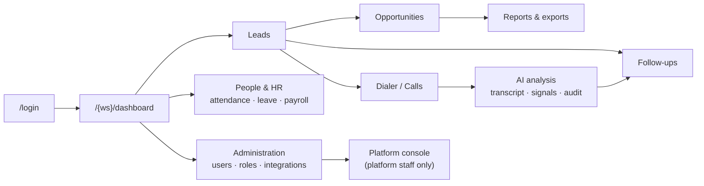

### Frontend technical debt

- **92 of 111 workspace pages query Prisma directly** (was 89 of 108 at R2).
  Safe — the tenant guard covers every one — but the same read then exists in a
  page, a service and an export, and the three drift.
- **Streaming is partial.** The assistant streams over SSE; _call analysis_ is
  request/response, so a long generation blocks a spinner rather than filling in.
- **Polling elsewhere.** Only the live-call and assistant surfaces push; the
  dialer queue and notification surfaces re-fetch.

---

## 4. Backend architecture

### 4.1 The kernel is the architecture

Every `/api/v1` route is wrapped in `route()` from `src/lib/api/handler.ts`. The
order of its six steps _is_ the security contract, and it is worth reading as
one thing because each step depends on the one before it:

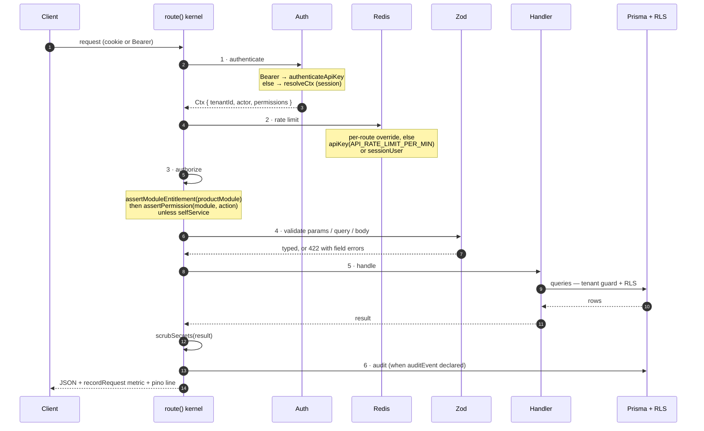

Three properties of that pipeline are worth calling out because they are
unusual:

- **Authorization precedes the handler body.** A handler cannot forget to check.
- **`scrubSecrets` runs on every response.** One `include: { platformUser: true }`
  was once enough to publish password hashes and live TOTP secrets; per-route
  `select`s are the real fix and this is the net beneath them.
- **Rate limits live in the route contract**, not in the handler, so they cannot
  be omitted by forgetting to call something.

### 4.2 Backend dependency map

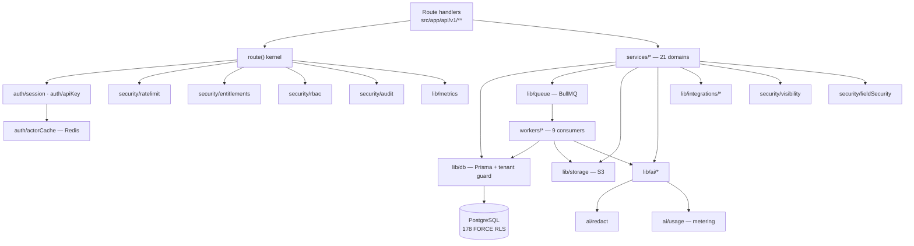

### 4.3 Background and scheduled work

Nine queues, nine consumers, exhaustive in **both** directions at the type level
— a queue added to `QueueName` cannot be invisible to monitoring, which is the
failure mode that let the entire worker process die unnoticed once.

| Queue           | Consumer                   | Work                                                |
| --------------- | -------------------------- | --------------------------------------------------- |
| `automation`    | `workers/automation.ts`    | Rule-engine actions                                 |
| `distribution`  | `workers/distribution.ts`  | Lead allocation                                     |
| `sla`           | `workers/sla.ts`           | Breach detection and escalation                     |
| `campaign`      | `workers/campaigns.ts`     | Scheduled campaign sends                            |
| `webhook`       | `workers/webhook.ts`       | Outbound delivery with retry                        |
| `maintenance`   | `workers/maintenance.ts`   | Daily retention sweep, **03:00 UTC**, concurrency 1 |
| `media`         | `workers/media.ts`         | Fetch recordings from vendor into own bucket        |
| `ai`            | `workers/ai.ts`            | Transcription, Gemini analysis, call audit          |
| `notifications` | `workers/notifications.ts` | Email for already-written notifications             |

The worker entrypoint **waits for every consumer to attach and exits non-zero
otherwise**, and arms schedulers only afterwards — so a partially-attached
worker is a failed deploy rather than a silent gap.

### 4.4 Webhooks

| Endpoint                                  | Direction | Authentication                                                        |
| ----------------------------------------- | --------- | --------------------------------------------------------------------- |
| `/api/v1/webhooks/telephony/[key]`        | Inbound   | The URL key _is_ the credential; Twilio and Plivo additionally sign   |
| `/api/v1/webhooks/telephony/[key]/answer` | Inbound   | Same                                                                  |
| `/api/v1/webhooks/meta/[key]`             | Inbound   | `appSecret` HMAC + `webhookVerifyToken`                               |
| Outbound webhooks                         | Outbound  | Signed with `WEBHOOK_SIGNING_PEPPER`, retried via the `webhook` queue |

Inbound webhook rate limiting happens **by key, before the key is looked up** —
the ordering that matters, since looking it up first would make the lookup
itself the attack surface.

---

## 5. Database architecture

### 5.1 Measured

| Property                               | Value         |
| -------------------------------------- | ------------- |
| Engine                                 | PostgreSQL 16 |
| Models / enums                         | 197 / 105     |
| Tables                                 | 198           |
| Indexes                                | 675           |
| Foreign keys                           | 415           |
| Tables with `FORCE ROW LEVEL SECURITY` | 178           |
| Policies attached                      | 178           |
| Migrations applied                     | 58            |
| Inbound FKs to `Tenant`                | **187**       |

That last figure is the multi-tenancy model stated structurally: 187 of 198
tables hold a foreign key to `Tenant`.

### 5.2 Multi-tenancy model — **shared database, shared schema**

Determined, not assumed. Evidence:

- One `DATABASE_URL`, one database, one `public` schema. No `CREATE SCHEMA` per
  tenant anywhere in 58 migrations, and no per-tenant connection routing.
- 187 tables carry a `tenantId` foreign key to `Tenant`.
- Isolation is a **`tenantId` column plus a row-level-security policy**, not a
  namespace.

It is emphatically **not** separate-database-per-tenant and **not**
separate-schema-per-tenant.

### 5.3 How isolation actually works — three independent layers

| Layer                  | Refuses                                                                                                                                                                                                      | Blind to                                                                                                                     |
| ---------------------- | ------------------------------------------------------------------------------------------------------------------------------------------------------------------------------------------------------------ | ---------------------------------------------------------------------------------------------------------------------------- |
| **API kernel**         | `resolveCtx` derives `tenantId` from the session cookie and re-validates membership every request. **No route accepts a `tenantId` from a body, query string or path** — verified across all 162 route files | Anything not going through a route: workers, sweeps, scripts                                                                 |
| **Prisma guard**       | A model read or filtered write with no `tenantId` in its `where`; a create with no `tenantId` in its data. Trips are counted _at the throw_, so a caller that swallows one still appears in metrics          | `$queryRaw` / `$executeRaw` — there is no `where` to inspect, so the extension returns early                                 |
| **Row-level security** | The row itself, for the `NOBYPASSRLS` role the application connects as. `FORCE` means the owner is filtered too                                                                                              | Tables read _in order to decide_ the tenant — a policy on `app.tenant_id` has nothing to match when the read is what sets it |

The RLS variable is set with `set_config('app.tenant_id', …, true)` —
**transaction-local**, which is both what prevents leakage to the next borrower
of a pooled connection and what makes PgBouncer transaction pooling safe.
`withTx(tenantId, fn)` and `withPlatformTx(fn)` are the two entry points;
the latter sets `app.platform_admin` instead, which the policies name explicitly.

### 5.4 ER diagram — the sales core and the identity core

Trimmed to the entities a reader needs; the full schema is 197 models.

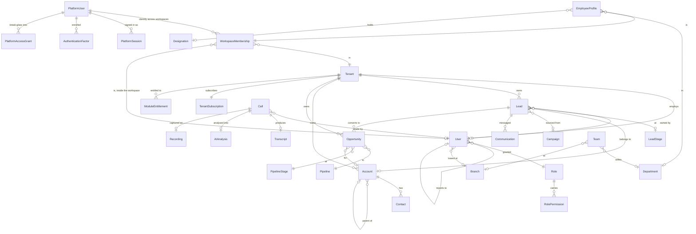

### 5.5 Schema discipline

- **Soft deletes** — `deletedAt` on the record models; the tenant guard adds
  `deletedAt: null` to reads automatically unless a caller opts out.
- **Audit fields** — `createdAt`, `updatedAt`, `createdById`, `updatedById`.
- **Transactions** — interactive transactions only through `withTx` /
  `withPlatformTx`, so the tenant setting and the work always share a connection.
- **Migrations** — `NOT VALID` / `VALIDATE` discipline for constraints on large
  tables; migrations carry comments explaining their own hazards; CI gates drift
  with `prisma migrate diff --exit-code`.
- **References** — one counter table rather than a Postgres sequence per tenant
  (which would have been ~100k relations at 10k tenants); `CREATE ON SCHEMA public`
  is revoked from the application role.

### 5.6 Database weaknesses

- **No partitioning** on the append-only tables (`AuditLog`,
  `HrAttendancePunch`, `PlatformAuditEvent`). Retention now exists for all three
  but **deletes nothing until an owner sets a period** — deliberately, because a
  default would destroy an audit trail on a number nobody chose.
- **No PITR.** Recovery point is the nightly backup.

---

## 6. Authentication & authorization

### 6.1 Identity model

Identity is **platform-level**, not workspace-level. A person is one
`PlatformUser`; a `WorkspaceMembership` links that identity to a `Tenant` and,
inside it, to a `User` row carrying the workspace role. This is what makes one
login work across several workspaces.

### 6.2 Login flow

```mermaid
sequenceDiagram
    autonumber
    participant U as User
    participant A as /api/v1/auth/login
    participant D as PostgreSQL
    participant R as Redis
    participant S as Session

    U->>A: email + password
    A->>R: rate limit — loginPerIp (10/15m) + loginPerAccount (5/15m)
    A->>D: load PlatformUser by email
    alt no such account
        A->>A: burnTiming() — verify a dummy Argon2 digest
        A-->>U: 401, one generic message
    end
    alt lockedUntil > now
        A-->>U: 401, one generic message
    end
    A->>A: verifyPassword — Argon2id m=19456 t=2 p=1
    alt wrong password
        A->>D: failedLoginCount += 1; lock at MAX_FAILED_LOGINS for LOCKOUT_MINUTES
        A-->>U: 401, one generic message
    end
    alt workspace mandates 2FA and enrolled
        A->>U: TOTP challenge
        U->>A: 6-digit code
        A->>A: verifyTotp — RFC 6238, SHA-1, 30s step, ±drift
    else mandates 2FA and NOT enrolled
        A->>S: session with purpose = MFA_ENROLMENT
        Note over S: reaches only enrolment, verification, logout —<br/>so mandating 2FA cannot lock out existing users
    end
    A->>S: token = randomBytes(32).base64url
    S->>D: PlatformSession { tokenHash: sha256(token), expiresAt }
    S->>U: Set-Cookie httpOnly · secure(prod) · SameSite=Lax
    A->>D: failedLoginCount = 0, lockedUntil = null, lastLoginAt = now
```

### 6.3 Token and session handling

| Property          | Implementation                                                                                                                                                                                                                                                                                                                                                                                                                   |
| ----------------- | -------------------------------------------------------------------------------------------------------------------------------------------------------------------------------------------------------------------------------------------------------------------------------------------------------------------------------------------------------------------------------------------------------------------------------- |
| Token             | 32 random bytes, base64url — **opaque, not a JWT**                                                                                                                                                                                                                                                                                                                                                                               |
| At rest           | `sha256(token)` in `PlatformSession.tokenHash`; the plaintext exists only in the cookie                                                                                                                                                                                                                                                                                                                                          |
| Cookie            | `httpOnly: true`, `secure: NODE_ENV === 'production'`, `sameSite: 'lax'`                                                                                                                                                                                                                                                                                                                                                         |
| Absolute lifetime | `SESSION_TTL_MINUTES`                                                                                                                                                                                                                                                                                                                                                                                                            |
| Idle timeout      | `SESSION_IDLE_TIMEOUT_MINUTES`, `lastSeenAt` refreshed per request                                                                                                                                                                                                                                                                                                                                                               |
| Refresh           | `POST /api/v1/auth/refresh` (**`src/app/api/v1/auth/refresh/route.ts`**, not `session.ts`) issues a new token and revokes the old one. Replaying an already-rotated token revokes **every** session for that account and writes a `ROTATED_TOKEN_REPLAYED` platform-audit event — the standard rotation response, deliberately unforgiving. Driven by `src/lib/auth/client.ts`, which collapses concurrent 401s into one refresh |
| Revocation        | `revokedAt` + `revokedReason`; "sign out everywhere" revokes all but the current                                                                                                                                                                                                                                                                                                                                                 |
| Workspace switch  | `switchActiveWorkspace` requires an **ACTIVE** membership for the target                                                                                                                                                                                                                                                                                                                                                         |
| Per-request       | `resolveCtx` re-validates the membership on **every** request, not just at login                                                                                                                                                                                                                                                                                                                                                 |

**There is no JWT anywhere in this system** — no signing key, no refresh-token
pair, no `exp` claim to get wrong. That removes an entire family of
vulnerabilities (alg confusion, unverified signature, unrevocable tokens) at the
cost of a database read per request, which the actor cache absorbs.

### 6.4 API keys

`Authorization: Bearer <key>` is the second credential. `APIKey` carries a
non-secret `prefix` and a `keyHash`, both single-column unique so the lookup
pins one row before any tenant is known. A key inherits
`actor.id = key.createdById`, carries `scopes` and an optional `ipAllowlist`,
and is rate-limited at `API_RATE_LIMIT_PER_MIN`.

### 6.5 Authorization — scoped RBAC

Not a flat permission list. Every `module:ACTION` resolves to a **scope**:

```
NONE  <  OWN  <  TEAM  <  BRANCH  <  REGION  <  ORGANIZATION
```

`assertPermission(ctx, module, action)` throws on `NONE` and returns the scope;
`visibilityWhere()` turns that scope into a Prisma `where` clause, so "sales rep
sees their own leads, branch manager sees the branch" is one mechanism rather
than a condition repeated per screen. The permission map is built once per
request from the role's rows and cached in Redis under
`rbac:actor:<tenant>:<user>`, invalidated by a version key `rbac:ver:<tenant>`
bumped from a Prisma hook — measured 13.28 ms → 0.15 ms.

Above that sit two orthogonal gates: **`assertModuleEntitlement`** (does this
workspace's subscription include SALES / HRMS?) and **field-level security**
(`FIELD_MAP`), which masks individual columns.

### 6.6 Platform (control-plane) authorization

Platform staff are `PlatformUser` rows with a `platformRole`. Reaching _into_ a
customer workspace to write requires **break-glass**: `fullControl` is
`platformRole === 'OWNER' && (await activeGrant(platformUserId, tenantId)) !== null`,
evaluated **per request**. Without a live, reasoned, time-boxed
`PlatformAccessGrant`, platform staff are read-only. An alert
(`PlatformWriteAccessOpen`) fires while any grant is open.

### 6.7 Security weaknesses in this area

- 🟡 **No CSRF token.** `SameSite=Lax` is the only cross-site protection. Adequate
  for a single-origin application; it stops being adequate the day a subdomain
  is added.
- 🔵 **`selfService` waives the permission check for API keys too.** A key reaches
  a self-service route as its creator with no permission check, whatever its
  scopes narrow it to. `/api/v1/notifications` refuses machine callers itself;
  the older `identity/self` and `hr/self` routes predate the decision and do not.
  Documented in the kernel, not accidental.

---

## 7. Network architecture

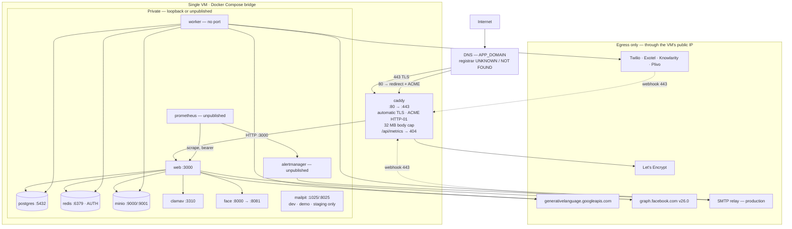

### Connection inventory

| #   | From → To             | Protocol / port | Transport security                                                     | Authentication                          | Direction   | Exposure    | Data                                    | Trust boundary |
| --- | --------------------- | --------------- | ---------------------------------------------------------------------- | --------------------------------------- | ----------- | ----------- | --------------------------------------- | -------------- |
| 1   | Browser → Caddy       | HTTPS 443       | TLS, auto-renewed, HSTS `max-age=63072000; includeSubDomains; preload` | Session cookie                          | Inbound     | **Public**  | Everything the user sees                | **Crossed**    |
| 2   | Browser → Caddy       | HTTP 80         | None — redirect + ACME only                                            | —                                       | Inbound     | **Public**  | Nothing but a 301                       | Crossed        |
| 3   | Caddy → web           | HTTP 3000       | **Plaintext**                                                          | None                                    | Internal    | Bridge      | Full request                            | Inside         |
| 4   | web/worker → postgres | TCP 5432        | **Plaintext** (`sslmode=disable` locally)                              | scram-sha-256, NOBYPASSRLS role         | Internal    | Loopback    | All tenant data                         | Inside         |
| 5   | web/worker → redis    | TCP 6379        | **Plaintext**                                                          | `requirepass` — **all five stacks**     | Internal    | Loopback    | Job payloads, cached permissions        | Inside         |
| 6   | web/worker → minio    | HTTP 9000       | **Plaintext**                                                          | S3 access key / secret                  | Internal    | Loopback    | Recordings, HR docs, biometric captures | Inside         |
| 7   | web → clamav          | TCP 3310        | **Plaintext**                                                          | None                                    | Internal    | Loopback    | Uploaded file bytes                     | Inside         |
| 8   | web → face            | HTTP 8000       | **Plaintext**                                                          | Bearer, constant-time compared, rotated | Internal    | Loopback    | Camera frames, vectors                  | Inside         |
| 9   | prometheus → web      | HTTP 3000       | **Plaintext**                                                          | Bearer via `credentials_file`           | Internal    | Unpublished | Metrics                                 | Inside         |
| 10  | alertmanager → relay  | SMTP            | Per relay                                                              | `smtp_auth_password_file`               | Outbound    | Egress      | Alert text                              | **Crossed**    |
| 11  | web/worker → Gemini   | HTTPS 443       | TLS                                                                    | Per-tenant or deployment API key        | Outbound    | Egress      | **Redacted** transcripts and prompts    | **Crossed**    |
| 12  | web → Meta Graph      | HTTPS 443       | TLS                                                                    | System-user access token                | Outbound    | Egress      | Template sends, recipient numbers       | **Crossed**    |
| 13  | worker → telephony    | HTTPS 443       | TLS                                                                    | Vendor credentials                      | Outbound    | Egress      | Call control, recording fetch           | **Crossed**    |
| 14  | Telephony → Caddy     | HTTPS 443       | TLS                                                                    | URL key; Twilio/Plivo also sign         | **Inbound** | **Public**  | Call status, recording URLs             | **Crossed**    |
| 15  | Meta → Caddy          | HTTPS 443       | TLS                                                                    | `appSecret` HMAC + verify token         | **Inbound** | **Public**  | Lead-gen, message status                | **Crossed**    |
| 16  | worker → SMTP relay   | SMTP            | Per relay                                                              | `SMTP_USER` / `SMTP_PASSWORD`           | Outbound    | Egress      | Notification mail                       | **Crossed**    |

**The summary a reader needs:** exactly two ports face the internet (80 and
443), both on Caddy. Everything else is bound to `127.0.0.1` or not published at
all. Behind the edge, **every hop is plaintext** — correct while there is one
host, and the first assumption that breaks on the second.

---

## 8. Network configuration

### LOCAL DEVELOPMENT

`infra/docker-compose.yml` + `docker-compose.dev.yml`.

| Item                              | Value                                                                                                      |
| --------------------------------- | ---------------------------------------------------------------------------------------------------------- |
| App URL                           | `http://localhost:3000`                                                                                    |
| Published ports (all `127.0.0.1`) | web 3000 · postgres 5432 · redis 6379 · minio 9000/9001 · mailpit 1025/8025 · clamav 3310 · face 8081→8000 |
| Not published                     | worker, prometheus, alertmanager (`observability` profile, unset here)                                     |
| TLS                               | None — `secure` cookie flag is off, CSP omits `upgrade-insecure-requests`                                  |
| CSP script-src                    | `'self' 'unsafe-inline' 'unsafe-eval'` (React Refresh needs eval)                                          |
| Mail                              | Mailpit, on purpose                                                                                        |
| Database                          | `leadflow`                                                                                                 |
| Redis                             | `requirepass` **set** — deliberately, so no environment leaves the AUTH path unexercised                   |

### STAGING

`docker-compose.yml` + `staging.yml`, own Compose project name.

| Item          | Value                                                                                                     |
| ------------- | --------------------------------------------------------------------------------------------------------- |
| Ingress       | `Caddyfile.staging`; reached over an **SSH tunnel** (`ssh -L 8080:127.0.0.1:8080`), not a public hostname |
| Database      | `leadflow_staging` — the `_staging` marker the boot check reads                                           |
| Demo seed     | **Refused**                                                                                               |
| Mail          | Mailpit, on purpose                                                                                       |
| Observability | Profile cleared — Prometheus and Alertmanager run                                                         |
| Log rotation  | `x-logging` json-file, 10 MB × 5                                                                          |

### PRODUCTION

`docker-compose.yml` + `prod.yml` + `azure.yml`.

| Item          | Value                                                                                                                                                                                                    |
| ------------- | -------------------------------------------------------------------------------------------------------------------------------------------------------------------------------------------------------- |
| Public ports  | **80 and 443 only**, on Caddy                                                                                                                                                                            |
| Hostname      | `${APP_DOMAIN}` — the value itself is **UNKNOWN / NOT FOUND**                                                                                                                                            |
| TLS           | Caddy automatic, ACME HTTP-01, Let's Encrypt                                                                                                                                                             |
| HSTS          | `max-age=63072000; includeSubDomains; preload` — set in `next.config.ts`, **not** the Caddyfile                                                                                                          |
| Other headers | `X-Content-Type-Options: nosniff`, `Referrer-Policy: strict-origin-when-cross-origin`, `Permissions-Policy: geolocation=(self), camera=(self), microphone=()`, `Cross-Origin-Opener-Policy: same-origin` |
| CSP           | Built per request in `src/proxy.ts`; adds `upgrade-insecure-requests`, drops `unsafe-eval`, **keeps `script-src 'unsafe-inline'`**                                                                       |
| Body cap      | 32 MB at Caddy; `UPLOAD_MAX_MB` (25) in the app                                                                                                                                                          |
| Metrics       | `/api/metrics` → 404 at the edge; scraped internally at `web:3000` with a bearer token                                                                                                                   |
| Mail          | Real relay, `${SMTP_HOST:?…}` — **refuses to start if unset**                                                                                                                                            |
| Database      | `master_saas_prod`                                                                                                                                                                                       |
| Demo seed     | **Refused**, three independent ways                                                                                                                                                                      |

### CORS

**No CORS middleware, no `Access-Control-Allow-Origin` anywhere.** Searched and
NOT FOUND. This is correct for the architecture: the browser talks to the same
origin that served the page, so there is no cross-origin request to permit. The
consequence is that a separate front-end origin cannot call this API without a
change.

### Rate limits (from `src/lib/security/ratelimit.ts`)

| Limit                | Ceiling                  | Window |
| -------------------- | ------------------------ | ------ |
| `loginPerIp`         | 10                       | 15 min |
| `loginPerAccount`    | 5                        | 15 min |
| `sessionUser`        | 1,200                    | 60 s   |
| `apiKey`             | `API_RATE_LIMIT_PER_MIN` | 60 s   |
| `publicForm`         | 5                        | 60 s   |
| `exportCreate`       | 10                       | 60 min |
| `mfaConfirm`         | 10                       | 5 min  |
| `inviteLookup`       | 30                       | 10 min |
| `passwordResetPerIp` | 20                       | 60 min |

Client IP is resolved from `X-Forwarded-For` **right to left, skipping hops in
`TRUSTED_PROXY_CIDRS`** — the only correct way to read that header behind a
proxy, and a common place to get spoofing wrong.

### UNKNOWN / NOT FOUND in this section

| Item                                              | Status                                                                                                    |
| ------------------------------------------------- | --------------------------------------------------------------------------------------------------------- |
| Actual production domain, DNS provider, registrar | **UNKNOWN** — `APP_DOMAIN` is an environment value                                                        |
| Firewall / security-group rules                   | **NOT FOUND** — deliberately out of `provision-host.sh` scope                                             |
| CDN                                               | **NOT FOUND** — no Cloudflare, Fastly or CloudFront configuration anywhere                                |
| Load balancer                                     | **NOT FOUND** — Caddy is a reverse proxy on the same host, not an LB                                      |
| WebSocket endpoints                               | **NOT FOUND** — none exist. Server-Sent Events _do_, on `/api/v1/calls/[id]/live` and `/api/v1/assistant` |
| Kubernetes networking                             | **NOT FOUND** — no manifests, no Helm chart                                                               |
| IP allow-listing at the edge                      | **NOT FOUND** — per-API-key `ipAllowlist` exists in the app; nothing at the network layer                 |

---

## 9. Cloud / infrastructure architecture

### 9.1 What the evidence actually supports

| Candidate                           | Evidence found                                                                              | Verdict                                                                          |
| ----------------------------------- | ------------------------------------------------------------------------------------------- | -------------------------------------------------------------------------------- |
| **Docker / Compose**                | 6 Compose files, multi-stage `Dockerfile`, overlay layering with `!reset`/`!override`       | ✅ **Confirmed — this is the deployment model**                                  |
| **Caddy**                           | `infra/Caddyfile`, `Caddyfile.staging`, `caddy:2-alpine`                                    | ✅ Confirmed                                                                     |
| **Let's Encrypt**                   | ACME email, HTTP-01 via ports 80/443                                                        | ✅ Confirmed                                                                     |
| **MinIO**                           | `minio` service, `S3_FORCE_PATH_STYLE`                                                      | ✅ Confirmed (S3-compatible, self-hosted)                                        |
| **systemd**                         | 6 units for backup, restore-verify, backup-status                                           | ✅ Confirmed                                                                     |
| **cloud-init**                      | `infra/cloud-init.yaml` calling `provision-host.sh`                                         | ✅ Confirmed — and **provider-agnostic**                                         |
| **Azure**                           | File _names_ (`docker-compose.azure.yml`, `DEPLOY-AZURE.md`), `azureuser@<vm>` in a comment | ⚠️ **Convention only.** No Azure SDK, no Bicep, no ARM, no `az` CLI. **UNKNOWN** |
| AWS                                 | `@aws-sdk/client-s3` — pointed at MinIO via `S3_ENDPOINT`                                   | ❌ Not an AWS deployment; the SDK is the S3 protocol client                      |
| GCP                                 | Gemini API key only                                                                         | ❌ Not a GCP deployment                                                          |
| Vercel / Netlify / Railway / Render | —                                                                                           | ❌ **NOT FOUND**                                                                 |
| Kubernetes                          | —                                                                                           | ❌ **NOT FOUND**                                                                 |
| Cloudflare                          | —                                                                                           | ❌ **NOT FOUND**                                                                 |
| Nginx / Apache                      | —                                                                                           | ❌ **NOT FOUND** — Caddy is the only proxy                                       |
| Azure Dev Tunnels                   | —                                                                                           | ❌ **NOT FOUND**                                                                 |
| Terraform / Pulumi                  | —                                                                                           | ❌ **NOT FOUND**                                                                 |

> **Stated plainly, because it is the assumption a reader is most likely to
> make: nothing in this repository proves which cloud the production VM runs
> on.** The Azure names are convention. `cloud-init.yaml` would boot this stack
> on any provider that supports cloud-init, or on bare metal.

### 9.2 Infrastructure diagram

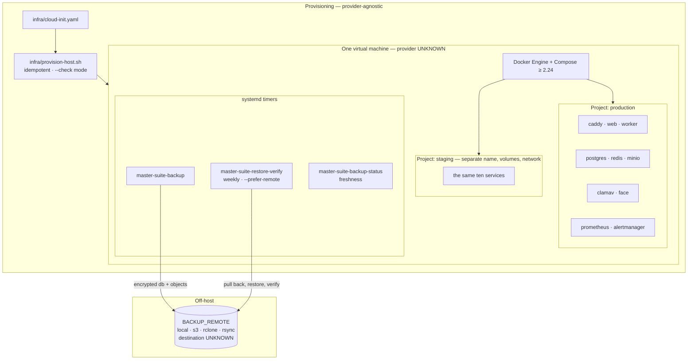

### 9.3 Infrastructure facts

| Concern    | Implementation                                                                                                       |
| ---------- | -------------------------------------------------------------------------------------------------------------------- |
| Compute    | One VM, Docker Compose, two full stacks (production + staging)                                                       |
| Database   | `postgres:16` container, volume-backed. **No PITR**                                                                  |
| Storage    | MinIO container on the VM disk                                                                                       |
| DNS        | `${APP_DOMAIN}`. Provider **UNKNOWN / NOT FOUND**                                                                    |
| TLS        | Caddy automatic, ACME HTTP-01                                                                                        |
| Secrets    | Per-environment generated; `<KEY>_FILE` indirection supported for a future secret manager                            |
| Deployment | `scripts/release.sh` — refuses a dirty tree, a tree/tag mismatch, and an unrehearsed migration                       |
| CI/CD      | `.github/workflows/ci.yml` (34 steps) and `deploy.yml` (`workflow_dispatch`, production behind approval)             |
| Backups    | Database **and** object store, encrypted, three systemd timers, weekly restore verification of the **off-host** copy |

---

## 10. AI architecture

### 10.1 Provider and model

**Google Gemini is the only AI provider.** Reached over plain REST — no vendor
SDK in the dependency tree. Model is `GEMINI_MODEL`, defaulting to
`gemini-flash-latest` (previously a hardcoded `gemini-2.0-flash`, changed so a
model retirement is a configuration change rather than a deploy).

Key resolution is **per tenant first**: an `IntegrationConnection` of kind
`gemini` carries the workspace's own key; `GEMINI_API_KEY` on the deployment is
the shared fallback, and it is the only one with a spend cap, because it is the
budget somebody else can exhaust. **With no key at all, the system runs an
honest, labelled simulation** rather than pretending or failing.

### 10.2 The pipeline

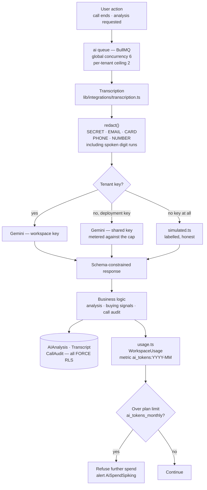

### 10.3 Controls

| Control                         | Implementation                                                                                                                                    |
| ------------------------------- | ------------------------------------------------------------------------------------------------------------------------------------------------- |
| **Egress redaction**            | `redact()` before every call. Five rule classes, including **spoken** digit sequences ("four one two three…") which a naive regex misses          |
| **Schema-constrained output**   | Responses are parsed against a schema, not string-scraped                                                                                         |
| **Idempotency**                 | Claim-before-bill, so a retried job cannot double-charge                                                                                          |
| **Metering**                    | Per workspace, per month, on `WorkspaceUsage` with a `(tenantId, metric)` unique                                                                  |
| **Ceiling**                     | Plan limit `ai_tokens_monthly`; absent means unlimited, because a platform that has not chosen a number must not refuse work on a guessed default |
| **Fairness**                    | `ai` queue global concurrency 6 with a per-tenant ceiling of 2 — measured, a second tenant's job moved from position 40 of 41 to 2 of 3           |
| **Permission-respecting tools** | The assistant's tools run **the caller's own permissions**, so it cannot read what the user could not                                             |
| **Error handling**              | Failures degrade to the labelled simulation or surface as a job failure; they do not silently produce empty analysis                              |

### 10.4 AI weaknesses

- 🟡 **Lead scoring is modelled and unimplemented.** `ScoringRule` and
  `LeadScoreHistory` exist, `Lead.score` exists with an index ordering by it, and
  `grep -rn "ScoringRule" src/` **returns nothing**. A lead list ordered by a
  score nothing computes is worse than one that does not claim to.
- 🔵 **Streaming is partial.** `/api/v1/assistant` streams over SSE; call
  analysis is request/response.

---

## 11. Data flow analysis

### 11.1 Lead creation → deal

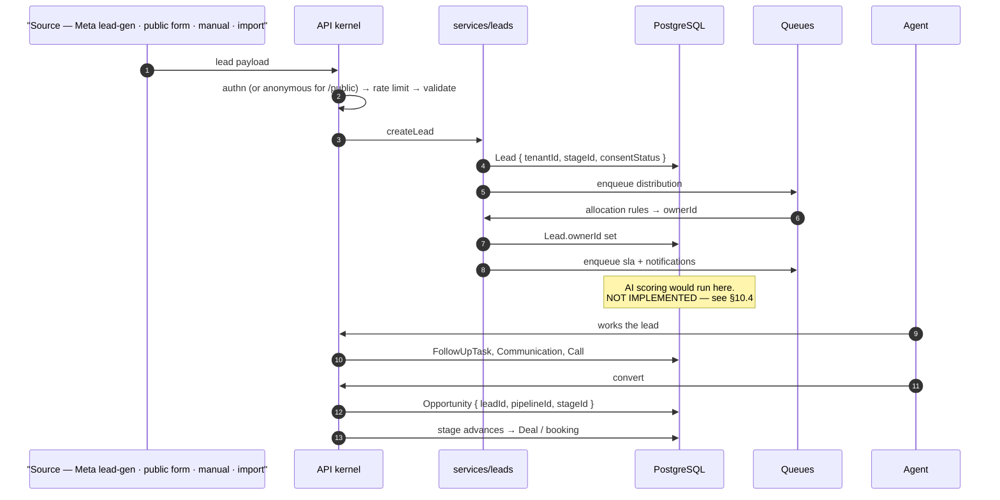

### 11.2 Call analysis

```mermaid
sequenceDiagram
    autonumber
    participant AG as Agent
    participant DL as Dialer
    participant V as Telephony vendor
    participant WH as "/api/v1/webhooks/telephony/[key]"
    participant M as media worker
    participant A as ai worker
    participant G as Gemini
    participant DB as PostgreSQL

    AG->>DL: claimNext — RUNNING campaigns only
    DL->>V: click-to-call
    V-->>WH: status callback (URL key; Twilio/Plivo sign)
    WH->>DB: Call row updated
    V-->>WH: recording URL
    WH->>WH: SSRF allow-list — RECORDING_URL_ALLOWED_HOSTS
    WH->>M: enqueue media
    M->>V: fetch audio
    M->>DB: Recording { storageKey t-<tenant>/… }
    M->>A: enqueue ai
    A->>A: transcribe → Transcript
    A->>A: redact()
    A->>G: analyse (schema-constrained)
    G-->>A: sentiment · objections · buying signals · next action
    A->>DB: AIAnalysis + CallAudit
    A->>DB: Lead updated; FollowUpTask suggested
    A->>DB: WorkspaceUsage ai_tokens:YYYY-MM += tokens
```

### 11.3 Employee workflow

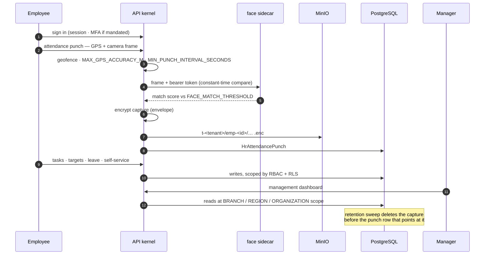

### 11.4 SaaS / tenancy workflow

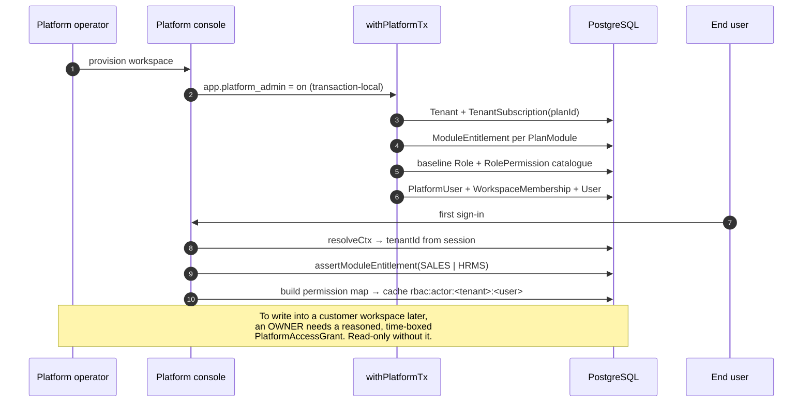

---

## 12. Security architecture — assessment

### 🟢 Good — several better than typical commercial practice

| Control                                   | Evidence                                                                                                                                                                                                                      |
| ----------------------------------------- | ----------------------------------------------------------------------------------------------------------------------------------------------------------------------------------------------------------------------------- |
| **Boot refuses a misconfiguration**       | `src/lib/startup-check.ts` verifies at runtime that the connected role is `NOBYPASSRLS`, is not a superuser, and owns no unforced table — and **kills the process** otherwise. RLS is not a control if the role can bypass it |
| **Three-layer tenant isolation**          | Kernel + Prisma guard + `FORCE RLS` on 178 tables, each independently sufficient for the model API                                                                                                                            |
| **The exemption lists check themselves**  | `tests/tenant/guard-exemptions.spec.ts` and `scripts/check-rls.mjs` fail on any entry naming a model or table that does not exist, or a field with no single-column unique index                                              |
| **Raw SQL is gated**                      | `scripts/check-raw-sql-scope.mjs` (CI gate 0c) asserts every raw statement naming an RLS-forced table runs on a transaction client                                                                                            |
| **Session rotation with theft detection** | `auth/refresh/route.ts` — replaying an already-rotated token revokes every session for the account and audits it as `ROTATED_TOKEN_REPLAYED`                                                                                  |
| **Opaque tokens, not JWTs**               | No signing key to leak, no `alg` to confuse, revocation is a row update                                                                                                                                                       |
| **MFA that cannot lock people out**       | `purpose: MFA_ENROLMENT` sessions reach only enrolment, verification and logout                                                                                                                                               |
| **Break-glass platform access**           | Read-only until a reasoned, time-boxed grant, re-evaluated per request, with an alert while open                                                                                                                              |
| **Egress redaction before AI**            | Including spoken digit sequences                                                                                                                                                                                              |
| **Unforgettable rate limits**             | Declared in the route contract, applied by the kernel                                                                                                                                                                         |
| **Constant-time secret comparison**       | Face-service token; `burnTiming()` on unknown accounts so a missing user costs the same as a wrong password                                                                                                                   |
| **Response scrubbing**                    | `scrubSecrets` on every kernel response                                                                                                                                                                                       |
| **Field-level encryption**                | Envelope encryption for sensitive columns                                                                                                                                                                                     |
| **SSRF allow-list**                       | `RECORDING_URL_ALLOWED_HOSTS` on the vendor-supplied recording URL                                                                                                                                                            |
| **Upload scanning**                       | ClamAV INSTREAM before an upload is accepted                                                                                                                                                                                  |
| **Argon2id**                              | m=19456, t=2, p=1 — tunable via env, sensible defaults                                                                                                                                                                        |
| **Correct `X-Forwarded-For` parsing**     | Right to left, skipping `TRUSTED_PROXY_CIDRS`                                                                                                                                                                                 |
| **Secrets never in `docker inspect`**     | Prometheus/Alertmanager render config into **tmpfs**; `credentials_file` / `smtp_auth_password_file`                                                                                                                          |
| **`<KEY>_FILE` indirection**              | Any variable can be read from a file — a secret manager can mount it with no code change                                                                                                                                      |

### 🔴 Critical

**None found.**

### 🟠 High

| #       | Finding                                                                                                                                                                                                                                                                                                                                                                   |
| ------- | ------------------------------------------------------------------------------------------------------------------------------------------------------------------------------------------------------------------------------------------------------------------------------------------------------------------------------------------------------------------------- |
| **H-1** | **Single point of failure by construction.** One VM holds application, worker, database, queue, object store, scanner, biometric engine, monitoring, and a second full stack for staging. Any host failure is total outage; recovery is the nightly backup, so worst case is a day of data. _Not a code defect — an accepted deployment risk that must be made explicit._ |

### 🟡 Medium

| #       | Finding                                                  | Evidence                                       | Impact                                                                                                                                                                                                                        |
| ------- | -------------------------------------------------------- | ---------------------------------------------- | ----------------------------------------------------------------------------------------------------------------------------------------------------------------------------------------------------------------------------- |
| **M-1** | `script-src 'unsafe-inline'`                             | `src/proxy.ts:42`                              | XSS is uncontained by CSP. A nonce with `strict-dynamic` was tried and does not survive Next 16.2.12's inline bootstrap — **verified in a browser** by `tests/e2e/csp.spec.ts`, not assumed. Framework-blocked, not neglected |
| **M-2** | Plaintext between services on the host                   | Connections 3–9 in §7                          | Contained today by everything being on one host. Becomes real the same day H-1 is fixed                                                                                                                                       |
| **M-3** | Logs rotate and go nowhere                               | `x-logging` in three overlays; no shipper      | Post-incident analysis is limited to what is on the host. The lines are already structured JSON with a request id — **the missing piece is a destination nobody has chosen**                                                  |
| **M-4** | No CSRF token                                            | `sameSite: 'lax'` only                         | Adequate for a single-origin app; stops being adequate the day a subdomain is added                                                                                                                                           |
| **M-5** | Features modelled without implementation                 | `ScoringRule`, billing tables                  | The product claims things it does not do                                                                                                                                                                                      |
| **M-6** | Object-store pagination unverified against a real bucket | `listObjects`, `listPrefixes`, `deleteObjects` | Exercised against a stand-in; pagination and 1,000-key batching are exactly what a stand-in cannot prove                                                                                                                      |

### 🔵 Low

| #       | Finding                                                                                                                                                                                                                                                                                                                                                             |
| ------- | ------------------------------------------------------------------------------------------------------------------------------------------------------------------------------------------------------------------------------------------------------------------------------------------------------------------------------------------------------------------- |
| **L-1** | Development credentials inline in four tracked files — `infra/docker-compose.prod.yml`, `.dev.yml`, `.yml`, `Dockerfile`. **Every one is overridden in the Azure overlay by a `${VAR:?…}` form that refuses to start when unset**, so no deployment inherits them. The residual risk is a reader copying the shape. _Location and risk named; no value reproduced._ |
| **L-2** | `selfService` waives the permission check for API keys as well as sessions (documented in the kernel; `/api/v1/notifications` refuses machine callers itself, the two older self-service routes do not)                                                                                                                                                             |
| **L-3** | Two 1,000-line HR dispatch routes — type-safe via total permission maps, still large                                                                                                                                                                                                                                                                                |
| **L-4** | No `X-Frame-Options` — superseded by `frame-ancestors 'none'`, so informational only                                                                                                                                                                                                                                                                                |
| **L-5** | The WPS SIF export is one bank's dialect; `SIF_LAYOUTS` is versioned but holds one entry                                                                                                                                                                                                                                                                            |

### Category-by-category

| Area                  | Verdict                                                                                      |
| --------------------- | -------------------------------------------------------------------------------------------- |
| Authentication        | 🟢 Opaque rotating tokens, Argon2id, lockout, timing-equalised failures, TOTP                |
| Authorization         | 🟢 Scoped RBAC, entitlements, field-level security, permission-respecting AI tools           |
| Tenant isolation      | 🟢 Three layers, audited invariant by invariant, gated in CI                                 |
| API security          | 🟢 One kernel, no route bypasses it                                                          |
| Input validation      | 🟢 Zod on params, query and body for every route                                             |
| SQL injection         | 🟢 Prisma parameterised; the 10 raw statements are gated and use bound parameters            |
| XSS                   | 🟡 React escapes by default; CSP cannot contain it (M-1)                                     |
| CSRF                  | 🟡 `SameSite=Lax` only (M-4)                                                                 |
| CORS                  | 🟢 None needed — same-origin architecture                                                    |
| SSRF                  | 🟢 Allow-list on the one caller-influenced URL                                               |
| File upload           | 🟢 ClamAV, size caps at edge and app, tenant-prefixed keys, scan state gates download        |
| Secrets exposure      | 🟢 Generated per environment, gitignored, tmpfs for monitoring, `_FILE` supported. 🔵 L-1    |
| Session security      | 🟢 httpOnly, secure in production, rotation, idle + absolute expiry                          |
| JWT                   | 🟢 N/A — none used                                                                           |
| Encryption            | 🟢 Envelope encryption at rest for sensitive fields; TLS at the edge. 🟡 M-2 inside the host |
| Database security     | 🟢 NOBYPASSRLS role, `CREATE` revoked, role split, boot verification                         |
| Audit logging         | 🟢 Two trails, secret keys scrubbed, retention built                                         |
| Rate limiting         | 🟢 Nine named limits in the route contract                                                   |
| Brute force / lockout | 🟢 Per-IP and per-account, plus `lockedUntil`                                                |

---

## 13. Deployment architecture

### 13.1 Build

Multi-stage `infra/Dockerfile`:

| Stage         | Purpose                                 | Entrypoint                      |
| ------------- | --------------------------------------- | ------------------------------- |
| `deps`        | Dependency install                      | —                               |
| `development` | Dev server                              | `npm run dev`, `EXPOSE 3000`    |
| `build`       | `next build` → standalone               | —                               |
| `production`  | Runtime image, non-root `USER leadflow` | `node server.js`, `EXPOSE 3000` |
| `worker`      | Same code, different role               | `tsx src/workers/index.ts`      |
| `runtime`     | Alias of `production`                   | —                               |

**The worker runs the TypeScript through `tsx`.** This is deliberate and is the
fix for R1's most serious finding: the previous command was
`node dist/workers/index.js` against an image that contained no `dist/`, so the
worker exited immediately on every deployment and — because no other service
depended on it — `docker compose up -d` reported success while every queue went
unconsumed.

### 13.2 Pipeline

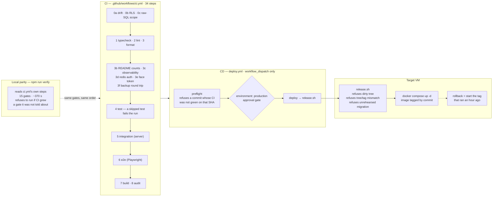

### 13.3 Deployment properties

| Property         | Implementation                                                                                         |
| ---------------- | ------------------------------------------------------------------------------------------------------ |
| Artifact         | Image tagged by commit (`master-suite/web:${IMAGE_TAG}`); the previous tag stays in the daemon's store |
| Promotion        | The **exact artifact** staging ran is promoted — not a rebuild                                         |
| Migration safety | A production migration is refused unless it finished in staging **with the same checksum**             |
| Rollback         | Start the tag that was running an hour ago — no rebuild, no registry, no network hop                   |
| Health checks    | `GET /api/health` → `{status, checks: {database, redis}}`; Compose `depends_on: service_healthy`       |
| Approval         | `environment: production` in `deploy.yml`                                                              |
| Monitoring       | Prometheus + Alertmanager come up with the stack; the overlay cannot omit them                         |
| Logging          | json-file, 10 MB × 5, gated in CI. **No destination off the host**                                     |

---

## 14. Third-party integrations

| Integration                               | Purpose                                                          | Direction | Authentication                                                       | Data                                                  | Status                                                  |
| ----------------------------------------- | ---------------------------------------------------------------- | --------- | -------------------------------------------------------------------- | ----------------------------------------------------- | ------------------------------------------------------- |
| **Google Gemini**                         | Call analysis, assistant, live coach, practice, follow-up drafts | Outbound  | API key — per tenant, or shared deployment key                       | **Redacted** transcripts and prompts                  | ✅ Live. Metered and capped                             |
| **Meta WhatsApp Cloud API** (Graph v26.0) | Campaign sends, event invitations, reminders                     | Both      | System-user access token; inbound `appSecret` HMAC + verify token    | Template messages, recipient numbers, delivery status | ✅ Live                                                 |
| **Meta Lead Ads**                         | Lead-gen form ingestion                                          | Inbound   | Same webhook credential                                              | Lead field payloads                                   | ✅ Live                                                 |
| **Twilio**                                | Voice, click-to-call                                             | Both      | Account credentials; **signs its callbacks** over URL + params       | Call control, status, recording URLs                  | ✅ Live                                                 |
| **Exotel**                                | India / SEA click-to-call                                        | Both      | Vendor credentials; **does not sign** — the URL secret authenticates | Call control, status                                  | ✅ Live                                                 |
| **Knowlarity**                            | India click-to-call                                              | Both      | Vendor credentials; **does not sign**                                | Call control, status                                  | ✅ Live                                                 |
| **Plivo**                                 | Global voice                                                     | Both      | Credentials; **signs with a nonce** over the URL                     | Call control, status                                  | ✅ Live                                                 |
| **Transcription provider**                | Call audio → text                                                | Outbound  | Per-workspace connection                                             | Call audio                                            | ✅ Live (provider selectable)                           |
| **Google Calendar / Meet**                | Meeting scheduling                                               | Outbound  | OAuth connection                                                     | Event metadata                                        | ✅ Live                                                 |
| **SMTP relay**                            | Transactional and notification mail                              | Outbound  | `SMTP_USER` / `SMTP_PASSWORD`                                        | Message bodies                                        | ✅ Live in production; Mailpit elsewhere **on purpose** |
| **ClamAV**                                | Upload scanning                                                  | Internal  | None (loopback)                                                      | File bytes                                            | ✅ Live                                                 |
| **Face sidecar**                          | Attendance biometrics                                            | Internal  | Bearer, constant-time, rotated                                       | Camera frames                                         | ✅ Live                                                 |
| **MinIO / S3**                            | Object storage                                                   | Internal  | Access key / secret                                                  | Recordings, HR docs, payslips, captures               | ✅ Live                                                 |
| **Let's Encrypt**                         | TLS certificates                                                 | Outbound  | ACME account                                                         | Domain validation                                     | ✅ Live                                                 |
| **Payment provider**                      | Billing                                                          | —         | —                                                                    | —                                                     | ❌ **None. Nothing charges anybody**                    |
| **SMS provider**                          | —                                                                | —         | —                                                                    | —                                                     | ❌ **None.** The settings that implied one were removed |
| **E-signature**                           | —                                                                | —         | —                                                                    | —                                                     | ❌ **None.** Same                                       |
| **Error reporting / APM**                 | —                                                                | —         | —                                                                    | —                                                     | ❌ **NOT FOUND**                                        |
| **Log aggregation**                       | —                                                                | —         | —                                                                    | —                                                     | ❌ **NOT FOUND** — see M-3                              |

---

## 15. Architecture diagrams

Nine diagrams are embedded above at the point they are needed rather than
collected here, which is where a reader actually wants them:

| #   | Diagram                             | Section    |
| --- | ----------------------------------- | ---------- |
| 1   | High-level system architecture      | §1.1       |
| 2   | Network architecture                | §7         |
| 3   | Frontend user journeys              | §3         |
| 4   | Backend dependency map              | §4.2       |
| 5   | Database ER diagram                 | §5.4       |
| 6   | Authentication sequence             | §6.2       |
| 7   | Lead lifecycle                      | §11.1      |
| 8   | AI architecture                     | §10.2      |
| 9   | Deployment pipeline                 | §13.2      |
| 10  | Multi-tenant request path           | below      |
| —   | API kernel sequence                 | §4.1       |
| —   | Call analysis, employee, SaaS flows | §11.2–11.4 |
| —   | Infrastructure                      | §9.2       |

### 10 · Multi-tenant request path — where a cross-tenant read would have to get through

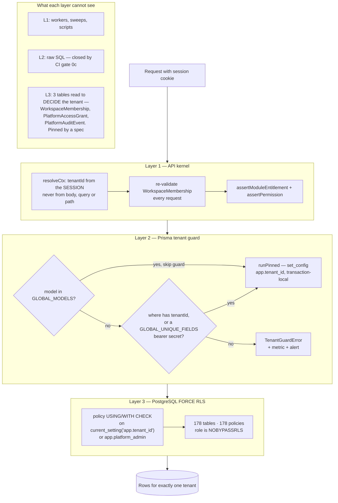

---

## 16. Architectural strengths

Concrete, with the evidence. Not compliments.

1. **The kernel makes the security contract unforgettable.** Authorization runs
   _before_ the handler body; rate limits are declared in the route spec, not
   called by the handler; audit fires from the kernel. A developer cannot omit
   a control by forgetting to call it — they would have to bypass `route()`,
   which is a review blocker and is grep-able.

2. **`scrubSecrets` on every response.** A defence that assumes the per-route
   `select` will one day be wrong, because it once was: a single
   `include: { platformUser: true }` published password hashes and live TOTP
   secrets.

3. **The process refuses to serve a misconfiguration.** `startup-check.ts`
   verifies the connected role cannot bypass RLS and exits otherwise. Most
   systems discover that in an incident.

4. **Controls are checked against reality, not against a list.**
   `scripts/check-rls.mjs` reads `pg_class` rather than a hand-kept array —
   and it now **validates its own exemption list** too. Three hand-kept lists
   used to have to stay in step by hand; a migration pasting a stale copy once
   dropped `FORCE` across every tenant table silently.

5. **Queue coverage is exhaustive in both directions at the type level.** A
   queue added to `QueueName` cannot be invisible to monitoring — which is
   exactly how a dead worker went unnoticed for months.

6. **Consumer counts are read from Redis at scrape time**, not kept by the
   enqueue path. A counter incremented on enqueue looks healthy in precisely
   the dead-worker failure it exists to catch.

7. **Transaction-local tenant settings.** `set_config(…, true)` is what makes
   both connection pooling and PgBouncer transaction mode safe. R2 recorded
   PgBouncer as _incompatible_; that was inverted, and the whole suite now
   passes through PgBouncer 1.22 in `pool_mode = transaction`.

8. **MFA that cannot lock out an existing user.** The `MFA_ENROLMENT` session
   purpose exists because mandating 2FA otherwise permanently locked out
   everyone who had not already enrolled.

9. **Break-glass instead of standing write access.** Platform OWNER used to hold
   unrestricted, permanent write into every tenant. It is now read-only until a
   reasoned, time-boxed grant, re-checked per request, with an alert while open.

10. **Honest degradation.** No AI key produces a _labelled_ simulation; no
    backup remote makes the weekly verifier degrade to the local copy **and say
    so**. Neither pretends.

11. **The comments carry the reasoning, and the reasoning is checked.** Several
    defects this engagement found were comments asserting controls that did not
    exist — a CSP nonce, a restore from a remote copy. Each was corrected _and_
    given a test, so the class fails a build now.

12. **One command reproduces CI.** `npm run verify` reads its gate list out of
    `ci.yml` rather than copying it, and refuses to run if CI grew a gate it was
    not told about.

---

## 17. Architectural weaknesses

**Problem → Evidence → Impact → Severity → Recommendation.**

### W-1 · Single point of failure, by construction

- **Problem** One VM holds every tier, plus a second full stack for staging.
- **Evidence** `infra/docker-compose.azure.yml`; the runbook's own "What this deployment is not".
- **Impact** Any host failure is total outage. No failover, no PITR; worst case is losing a day.
- **Severity** 🟠 High — the only High that remains.
- **Recommendation** Managed Postgres with PITR, managed Redis, object storage off the VM. **The application side is done and verified**: `sslmode=require`, `rediss://`, and any S3 endpoint are accepted unchanged. This is procurement and connection strings.

### W-2 · Business logic in server components

- **Problem** 92 of 111 workspace pages query Prisma directly (was 89 of 108).
- **Evidence** `grep -rl "from '@/lib/db'" "src/app/(workspace)" --include=page.tsx` → 92.
- **Impact** Safe — the tenant guard covers every one — but the same read then lives in a page, a service and an export, and they drift.
- **Severity** 🟡 Medium.
- **Recommendation** Move read shapes into `src/services/*` as they are next touched. Not a rewrite.

### W-3 · Logs rotate and go nowhere

- **Problem** No log destination outside the host.
- **Evidence** `x-logging` json-file in three overlays; no shipper, no aggregation service.
- **Impact** Post-incident analysis limited to the host; logs die with it.
- **Severity** 🟡 Medium.
- **Recommendation** The lines are structured JSON with a request id — **choose a destination.** That is a decision, not work.

### W-4 · Unbounded tables have a policy mechanism and no policy

- **Problem** `AuditLog`, `HrAttendancePunch`, `PlatformAuditEvent` grow monotonically.
- **Evidence** Retention is built and proven across two tenants, and **deletes nothing until a window is set**.
- **Impact** Monotonic growth; partitioning without a policy turns one growing table into many.
- **Severity** 🟡 Medium.
- **Recommendation** Set the number (D-3), then partition by month. Growth is already measured by `masterapp_table_rows_estimate` and `masterapp_table_bytes`.

### W-5 · Features whose schema shipped without an implementation

- **Problem** Lead scoring and billing are modelled and unimplemented.
- **Evidence** `grep -rn "ScoringRule" src/` returns nothing; no payment provider of any kind.
- **Impact** The product claims things it does not do. A lead list ordered by a score nothing computes is a support burden and a credibility one.
- **Severity** 🟡 Medium.
- **Recommendation** Decide (D-1, D-2), then build or remove.

### W-6 · Plaintext inside the host

- **Problem** Every hop behind Caddy is unencrypted.
- **Evidence** §7 connections 3–9.
- **Impact** Contained by everything being on one machine; that is a genuine mitigation and a fragile one.
- **Severity** 🟡 Medium.
- **Recommendation** TLS or mTLS the same day W-1 is fixed, not before.

### W-7 · CSP cannot contain XSS

- **Problem** `script-src 'unsafe-inline'`.
- **Evidence** `src/proxy.ts:42`; `tests/e2e/csp.spec.ts` verifies the state in a real browser.
- **Impact** Every other XSS control is in place; the containment layer is not.
- **Severity** 🟡 Medium — framework-blocked, not neglected.
- **Recommendation** Close it when Next supports nonce propagation, or hash the inline bootstrap at build time.

### W-8 · Two large dispatch routes

- **Problem** `hr/[resource]/route.ts` (1,089 lines) and `hr/actions/[action]/route.ts` (974 lines).
- **Evidence** Line counts.
- **Impact** Reduced since R1 — both permission maps are total over their enums, so an undeclared resource or action is a compile error rather than a silent fall-through. What remains is readability.
- **Severity** 🔵 Low.
- **Recommendation** Split by resource family when one is next changed.

### W-9 · Object-store calls unproven against a real bucket

- **Problem** `listObjects`, `listPrefixes`, `deleteObjects` run against a stand-in in CI.
- **Evidence** No object-storage service in CI; MinIO needs a Docker daemon.
- **Impact** Pagination and 1,000-key batching are exactly what a stand-in cannot prove, and they run in a sweep that deletes.
- **Severity** 🟡 Medium.
- **Recommendation** One manual run against MinIO before that code sweeps a real bucket.

### W-10 · Provisioning stops at the VM

- **Problem** `provision-host.sh` configures the host from inside; the VM, its security group and its DNS record are not described.
- **Evidence** No Terraform, Bicep, ARM or provider SDK anywhere.
- **Impact** The machine cannot be recreated from the repository — only its contents can.
- **Severity** 🔵 Low — and a **deliberate** stop: a provider module that has never run against a real subscription is a liability that reads like an asset.
- **Recommendation** Add it when a provider is actually committed to.

---

## 18. Scalability analysis

The code and the deployment scale very differently. Every ceiling R1 and R2
identified **in the code** has been raised; what remains is the machine.

### 10 organizations — comfortable

Nothing strains. One VM, one Postgres, 9 queue consumers. Current test data
(500 leads, 8 opportunities in a seeded workspace) renders in the low hundreds
of milliseconds.

### 100 organizations — fine, watch two things

| Dimension      | Assessment                                                                  |
| -------------- | --------------------------------------------------------------------------- |
| Database       | Fine. 675 indexes, keyset pagination, RLS predicates hit indexed `tenantId` |
| API            | Fine — stateless per request; permission build is 0.15 ms cached            |
| Auth           | Fine. Actor cache absorbs the per-request session read                      |
| Queues         | Fine. Per-tenant fairness prevents one backlog monopolising the `ai` queue  |
| **Storage**    | ⚠️ Object storage on the VM disk is the first physical limit                |
| **Monitoring** | ⚠️ Prometheus shares the host with what it watches                          |

### 1,000 organizations — needs infrastructure, not code

| Dimension    | Bottleneck                                                                                                                                                |
| ------------ | --------------------------------------------------------------------------------------------------------------------------------------------------------- |
| Database     | Connection count, not query shape. `connection_limit=20` per process; PgBouncer is written, verified and switched off pending the saturation metric       |
| Web tier     | **Ready to scale horizontally** — the last stateful thing (attendance captures on local disk) moved to object storage. What is missing is a load balancer |
| Queues       | Redis single instance becomes the coordination point                                                                                                      |
| Storage      | Must be off the VM by here                                                                                                                                |
| Audit tables | Partitioning needed — which needs the retention _decision_ first                                                                                          |
| Logs         | Aggregation stops being optional                                                                                                                          |

### 10,000 organizations — a different deployment, the same application

| Dimension          | What changes                                                                                                                                   |
| ------------------ | ---------------------------------------------------------------------------------------------------------------------------------------------- |
| Database           | Managed Postgres with read replicas (`prismaRead` already exists and is used by reports and exports), and probably shard-by-tenant beyond this |
| Reference counters | Already fixed — one counter table instead of a Postgres sequence per tenant, which would have been ~100k relations                             |
| Web                | Multi-replica behind a load balancer; stateless already                                                                                        |
| Queues             | Redis Cluster or a managed queue                                                                                                               |
| RLS                | Holds — the policy is an indexed equality predicate, not a scan                                                                                |
| Tenant isolation   | **Unchanged.** The model does not need to change at any scale on this list                                                                     |

### The likely bottlenecks, in order

1. **The single VM** — everything else is downstream of this.
2. **Object storage on the VM disk** — the first thing to fill.
3. **Postgres connections** — before query performance, and PgBouncer is ready.
4. **Redis as a single coordination point** — queues, rate limits, two caches.
5. **Append-only tables without partitioning** — blocked on a retention decision.
6. **Prometheus on the host it watches** — it dies with what it is meant to report on.

**The strongest statement available about this architecture: none of the above
requires changing the tenant-isolation model, the authorization model, or the
API surface. It is the deployment that needs to grow up, not the application.**

---

## 19. Production readiness

| Area                     |     R3 |  R2 |  R1 | Explanation                                                                                                                                                                                                                                                                                                                                                                                                                                                                                   |
| ------------------------ | -----: | --: | --: | --------------------------------------------------------------------------------------------------------------------------------------------------------------------------------------------------------------------------------------------------------------------------------------------------------------------------------------------------------------------------------------------------------------------------------------------------------------------------------------------- |
| **Architecture**         | **87** |  86 |  82 | Boundaries are real and consistently held: one kernel, one Prisma client, one Redis client, one S3 client, business logic in `services/`. The campaign-channel and dialer-status defects are closed with tests that fail on the previous commit. Loses points for two 1,000-line dispatch routes, 92 pages querying Prisma directly, and a feature whose schema shipped without its engine                                                                                                    |
| **Security**             | **91** |  88 |  78 | Excellent, several controls better than typical commercial practice — boot-time RLS verification, opaque rotating tokens with theft detection, break-glass platform access, egress redaction including spoken numbers, unforgettable rate limits, and now two CI gates over the tenancy exemption lists themselves. Held back by `unsafe-inline` (framework-blocked), plaintext intra-host traffic, and no CSRF token                                                                         |
| **Scalability**          | **72** |  71 |  48 | Query patterns were always right. Every code-level ceiling is raised — sequences, permission builds, AI fairness, pooling — and attendance captures moving to object storage removed the last blocker to a stateless web tier. What remains is one VM and no load balancer                                                                                                                                                                                                                    |
| **Database**             | **93** |  91 |  84 | 197 models, 675 indexes, 415 FKs, RLS forced and policied on 178 tables and verified in CI, drift-gated, keyset pagination, `NOT VALID`/`VALIDATE` discipline, migrations that explain their own hazards. Retention now exists for the three append-only tables. Loses points for no partitioning, and for retention that deletes nothing until an owner sets a period                                                                                                                        |
| **Network**              | **78** |  70 |  62 | The edge is right: Caddy, automatic TLS, HSTS preload, two public ports — verified by rendering the configuration rather than reading the runbook. Redis AUTH closed the largest gap. Everything behind the edge is still plaintext                                                                                                                                                                                                                                                           |
| **AI**                   | **86** |  86 |  74 | Genuinely well-architected: per-tenant BYO keys, redaction at the boundary that catches spoken numbers, schema-constrained output, claim-before-bill idempotency, honest labelled simulation, tools that run the caller's own permissions, per-workspace metering with a plan ceiling, per-tenant fairness. Loses the same points as R2: lead scoring modelled and unimplemented, and no streaming                                                                                            |
| **DevOps**               | **88** |  74 |  41 | Commit-tagged images, promotion of the exact artifact staging ran, one-command reversible rollback, a staging-first migration gate with checksum matching, encrypted scheduled backups with weekly restore verification **of the off-host copy**, 34 CI steps, CD with production behind approval, infrastructure as code for the host, and local parity that reads the workflow rather than copying it. Loses points for one deployment host and three backup transports proven only by hand |
| **Multi-tenancy**        | **97** |  93 |  88 | Three independent layers, `FORCE` on 178 tables, a `NOBYPASSRLS` runtime role with `CREATE` revoked, transaction-local settings that survive a transaction pooler, and now **the exemption lists themselves checked against the schema and the catalog every run**. Short of 100 only because three control-plane tables are carried by application code alone — unavoidably, since each is read to decide the tenant — and those are now pinned by a spec                                    |
| **Monitoring**           | **80** |  45 |  12 | A running Prometheus and Alertmanager in both deployment overlays, 16 metric series, 12 rules each matching a failure this codebase has actually had, consumer counts read from Redis _at scrape time_, and CI failing the build if an overlay stops starting them. Short of full marks for no tracing, no error reporting, no log destination, and a monitoring stack sharing a host with what it watches                                                                                    |
| **Production readiness** | **84** |  73 |  46 | Deployable to a real customer today with an accepted single-host risk. **Every remaining blocker is a decision or a procurement, not an engineering task**                                                                                                                                                                                                                                                                                                                                    |

**Overall: 84 / 100** (R2: 73 · R1: 46).

---

## 20. Final architecture report

### Current architecture

One Next.js 16.2.12 application, server-rendered, with a second process of the
same image draining nine BullMQ queues and a Python sidecar doing face
recognition. One PostgreSQL 16 database holds 197 models for every tenant,
isolated by `tenantId` and enforced three times over. Redis carries queues, rate
limits and two caches. MinIO holds recordings, HR documents, payslips and
biometric captures. Google Gemini is the only AI provider, reached over plain
REST with redaction at the boundary. Every `/api/v1` route passes through one
kernel that authenticates, rate-limits, authorizes, validates, handles, scrubs
and audits — in that order.

### Current network

One public ingress: Caddy on 80 and 443, automatic TLS, HSTS preload. Everything
else is bound to loopback or unpublished — verified by rendering the production
configuration, not by reading the runbook. Inbound webhooks from telephony
vendors and Meta arrive through the same Caddy and are rate-limited **by key
before the key is looked up**. Outbound traffic is egress-only to Gemini, an
SMTP relay, Meta and telephony vendors. `/api/metrics` is 404'd at the edge and
scraped internally over a bearer token. Behind the edge, every hop is plaintext.

### Current security

**Secure:** tenant isolation (three layers, audited invariant by invariant),
authentication, authorization, password handling, MFA for privileged roles,
session rotation with theft detection, audit trails, rate limiting, upload
scanning, AI egress redaction, SSRF allow-listing, secret handling, and a boot
gate that refuses to serve a misconfiguration. Several of these are better than
typical commercial practice.

**Not secure:** `script-src 'unsafe-inline'` leaves XSS uncontained by CSP
(framework-blocked, verified in a browser). Intra-host traffic is plaintext.
There is no CSRF token beyond `SameSite=Lax`.

### Current risks — top 10

| #   | Risk                                                                                                               | Severity  |
| --- | ------------------------------------------------------------------------------------------------------------------ | --------- |
| 1   | **Single VM** — no failover, no PITR, worst case a day of data, and the monitoring stack dies with what it watches | 🟠 High   |
| 2   | Logs rotate and go nowhere — post-incident analysis limited to the host                                            | 🟡 Medium |
| 3   | `unsafe-inline` in `script-src`                                                                                    | 🟡 Medium |
| 4   | Plaintext between services — a genuine mitigation today, void on a second host                                     | 🟡 Medium |
| 5   | Lead scoring and billing modelled and unimplemented — the product claims them                                      | 🟡 Medium |
| 6   | `AuditLog` and `HrAttendancePunch` grow without a policy — the sweep exists and waits for a number                 | 🟡 Medium |
| 7   | Object-store pagination and 1,000-key batching unproven against a real bucket                                      | 🟡 Medium |
| 8   | Three backup transports (`s3`, `rclone`, `rsync`) proven only by hand                                              | 🟡 Medium |
| 9   | No CSRF token — latent until a subdomain is added                                                                  | 🔵 Low    |
| 10  | The VM itself is not described in the repository                                                                   | 🔵 Low    |

### Required changes before production

1. **Choose a log destination.** The lines are structured and rotation is in place.
2. **Answer lead scoring and billing** — build or remove.
3. **Set the audit retention period.** The sweep is built and deletes nothing without it.
4. **Accept the single-host risk explicitly, in writing**, or start P2-1.

All four are decisions. None is an engineering task.

### Future architecture

Managed Postgres with PITR and a read replica (`prismaRead` already exists and
is used by reports and exports); managed Redis with TLS and AUTH; object storage
off the VM; a stateless multi-replica web tier behind a load balancer; PgBouncer
in front of the database (verified compatible, written, switched off pending the
saturation metric); partitioned audit and attendance tables behind a retention
policy; a secret manager mounting files (`<KEY>_FILE` is already supported); log
aggregation; and infrastructure as code for the machine itself.

**None of that requires changing the tenant-isolation model, the authorization
model or the API surface** — which is the strongest statement that can be made
about this architecture.

### Priority roadmap

#### P0 — Critical · fix immediately

**None.** Every P0 revision 2 raised is closed.

#### P1 — Production · before paying customers

|      | Item                                                   | Reference | Who                  |
| ---- | ------------------------------------------------------ | --------- | -------------------- |
| P1-1 | Choose a log destination                               | W-3       | Decision             |
| P1-2 | Answer lead scoring and billing — build or remove      | W-5       | Decision (D-1, D-2)  |
| P1-3 | Set the audit retention period                         | W-4       | Decision (D-3)       |
| P1-4 | One manual run of the object-store calls against MinIO | W-9       | Engineering, ~1 hour |

#### P2 — Scale · as customer volume grows

|      | Item                                                                                     | Reference |
| ---- | ---------------------------------------------------------------------------------------- | --------- |
| P2-1 | Managed Postgres with PITR; managed Redis with TLS; object storage off the VM            | W-1       |
| P2-2 | TLS or mTLS between services — the same day P2-1 lands, not before                       | W-6       |
| P2-3 | Exercise the `s3`, `rclone` and `rsync` backup transports against a real remote          | §13       |
| P2-4 | Partition `AuditLog` and `HrAttendancePunch` by month, **after** P1-3                    | W-4       |
| P2-5 | Turn on the PgBouncer overlay once the saturation metric says the pool is the constraint | §18       |
| P2-6 | A load balancer in front of a multi-replica web tier                                     | §18       |

#### P3 — Optimization

|      | Item                                                                                               | Reference |
| ---- | -------------------------------------------------------------------------------------------------- | --------- |
| P3-1 | Close the CSP gap when Next supports nonce propagation, or hash the inline bootstrap at build time | W-7       |
| P3-2 | Move page-level Prisma reads into `services/` as they are next touched                             | W-2       |
| P3-3 | Split the two HR dispatch routes when one is next changed                                          | W-8       |
| P3-4 | Convert the inline Compose credentials to `${VAR:?…}` throughout                                   | L-1       |
| P3-5 | A CSRF token, if a subdomain is ever added                                                         | M-4       |
| P3-6 | Infrastructure as code for the VM, once a provider is committed to                                 | W-10      |
| P3-7 | A second SIF layout, once a second bank is onboarded                                               | L-5       |

#### Decisions this roadmap cannot make

|     | Question                                                                                                        | Why it is not an implementer's call                                    |
| --- | --------------------------------------------------------------------------------------------------------------- | ---------------------------------------------------------------------- |
| D-1 | **Lead scoring** — build the rule engine, or delete `ScoringRule`, `LeadScoreHistory` and the `ORDER BY score`? | Both defensible; they differ by weeks of work                          |
| D-2 | **Billing** — connect a payment provider, or take the billing language off the product?                         | Nothing charges anybody today                                          |
| D-3 | **Audit retention** — how long, and may these tables be deleted at all?                                         | A regulator's answer, not a database's                                 |
| D-4 | **Break-glass approval** — should a second person approve platform write access?                                | A platform with one owner could not satisfy it and would be locked out |

---

## Appendix · UNKNOWN / NOT FOUND

Stated rather than inferred, because a gap presented as a fact is worse than a gap.

| Question                                                                    | Status                                                                                                                                                                                                                                          |
| --------------------------------------------------------------------------- | ----------------------------------------------------------------------------------------------------------------------------------------------------------------------------------------------------------------------------------------------- |
| Which cloud the production VM runs on                                       | **UNKNOWN.** `docker-compose.azure.yml` and `DEPLOY-AZURE.md` name Azure by convention. There is **no** provider SDK, Terraform, Bicep, ARM or cloud CLI anywhere, and `cloud-init.yaml` is provider-agnostic. Nothing here proves any provider |
| Production domain, DNS provider, registrar                                  | **UNKNOWN** — `APP_DOMAIN` and `ACME_EMAIL` are environment values                                                                                                                                                                              |
| The host's size, region, disks, firewall or security-group rules            | **NOT FOUND** — deliberately outside `provision-host.sh`                                                                                                                                                                                        |
| CDN, load balancer, WAF                                                     | **NOT FOUND** — none configured anywhere                                                                                                                                                                                                        |
| Kubernetes / Helm                                                           | **NOT FOUND**                                                                                                                                                                                                                                   |
| WebSocket endpoints                                                         | **NOT FOUND**. SSE exists on two routes (`calls/[id]/live`, `assistant`); every other live-feeling screen polls                                                                                                                                 |
| CORS configuration                                                          | **NOT FOUND** — and correctly so for a same-origin architecture                                                                                                                                                                                 |
| Whether the off-host backup remote is configured on the live deployment     | **UNKNOWN** — `BACKUP_REMOTE` is an environment value; the weekly verifier degrades out loud when unset                                                                                                                                         |
| Whether the `s3` / `rclone` / `rsync` transports work against a real remote | **NOT VERIFIED** — only `local` is covered by CI                                                                                                                                                                                                |
| Whether the object-store calls paginate correctly against a real bucket     | **NOT VERIFIED** — CI has no object-storage service                                                                                                                                                                                             |
| Whether anyone receives the Alertmanager notifications                      | **UNKNOWN** — the stack refuses to start without a relay and recipients, which proves they are _set_, not that mail arrives                                                                                                                     |
| Actual production traffic, tenant count or data volume                      | **NOT FOUND** — no telemetry from a live deployment is in this repository                                                                                                                                                                       |
| Error-reporting / APM tooling                                               | **NOT FOUND**                                                                                                                                                                                                                                   |

---

_Assessed at commit `07d39c8`, 2026-08-22, on branch
`claude/master-suite-architecture-f2d7u3`. Measurements taken against a live
PostgreSQL 16 catalog with all 58 migrations applied, rendered Compose
configurations for six stacks, a full local run of every gate CI runs — 1,538
tests across 124 files, none skipped — and the application itself, launched and
driven in a browser. No credential value appears anywhere in this document._
