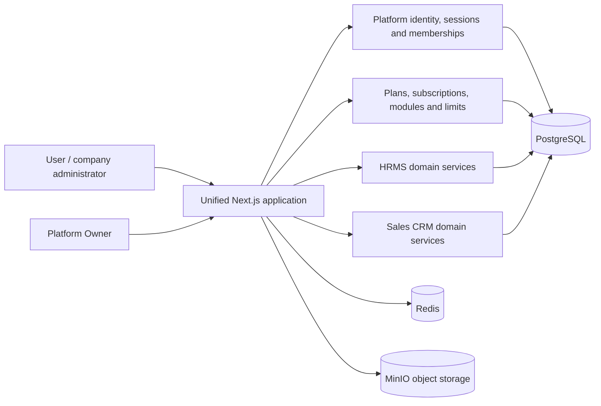

# Master architecture

## Runtime boundary

The target is one public Next.js application, one platform identity authority,
one canonical workspace identifier, and one PostgreSQL database. HRMS and Sales
are product modules inside that workspace—not separate customer applications.

## Ownership and authorization

- `PlatformUser` owns credentials, authentication factors and sessions.
- `WorkspaceMembership` links an identity to one company.
- `MembershipRole` and the existing RBAC permission graph define company access.
- `Tenant.id` is the canonical workspace ID on HRMS and Sales records.
- `TenantSubscription`, `SubscriptionModule`, `ModuleEntitlement`, `PlanLimit`
  and `WorkspaceUsage` enforce commercial access and capacity.
- Platform Owner APIs use a separate platform-role guard and produce platform
  audit events.
- Company APIs resolve the authenticated membership, requested workspace slug,
  module entitlement and permission before accessing data.

The legacy Python HRMS source is retained only as a migration/reference artifact.
It is not installed, seeded or started by the unified Windows scripts.
