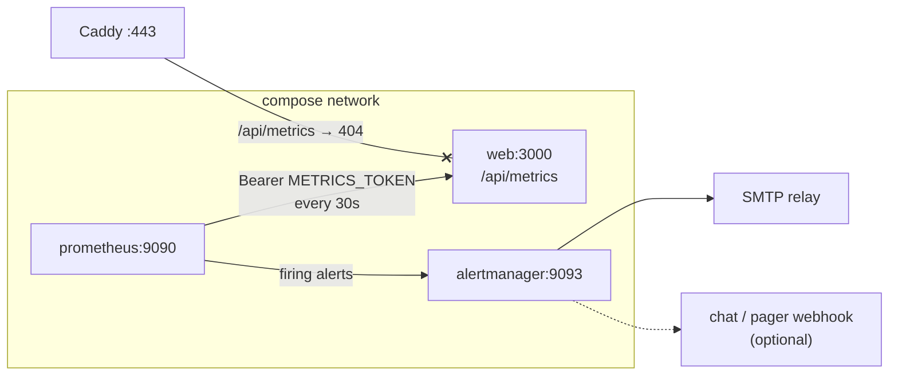

# Observability

`GET /api/metrics` has served Prometheus exposition since the observability work
landed, and for a while nothing read it. The second architecture assessment
scored monitoring 45/100 for exactly that reason and said so plainly: *the alert
rules are a file, not a running system.* This document describes the system.

## What runs

Both deployment overlays start two containers alongside the application.



Caddy answers `/api/metrics` with 404 from the public interface on purpose. The
endpoint exposes no customer data, but it does expose a complete map of the
product's route surface, its error rates and its queue names, and that is free
reconnaissance. The scrape therefore happens over the compose network, which is
a path only something already inside the deployment has — and the bearer token
is still required on it.

| Service | Image | Config | Reached at |
| --- | --- | --- | --- |
| `prometheus` | `prom/prometheus:v3.1.0` | `infra/prometheus.yml`, rules from `infra/prometheus-alerts.yml` | `127.0.0.1:9090` (production) · `:9091` (staging) |
| `alertmanager` | `prom/alertmanager:v0.28.0` | generated by `infra/alertmanager-entrypoint.sh` | `127.0.0.1:9093` (production) · `:9094` (staging) |

Neither has authentication of its own, so neither is published beyond loopback.
Reach them over SSH:

```bash
ssh -L 9090:127.0.0.1:9090 -L 9093:127.0.0.1:9093 azureuser@<vm>
```

## Why the services live in the base compose file

They are defined in `infra/docker-compose.yml` behind `profiles: ['observability']`,
and both `docker-compose.azure.yml` and `docker-compose.staging.yml` clear the
profile with `profiles: !reset []`.

The alternative — a `docker-compose.observability.yml` layered with a fourth
`-f` — was rejected because `infra/docker-compose.pgbouncer.yml` is already the
example of what that becomes. A control that depends on remembering an extra
flag on every runbook line lasts exactly as long as nobody is in a hurry. Here,
layering a deployment overlay *is* opting in, and `npm run check:observability`
fails the build if either overlay stops doing it.

Development does not start them. `npm run secrets` does write a `METRICS_TOKEN`
into `.env`, so the scrape would work — but Alertmanager refuses to start
without a relay and a recipient, and that refusal would take `docker compose up`
down with it over two containers a developer has no use for. To look anyway:

```bash
ALERT_EMAIL_TO=me@example.com SMTP_HOST=mailpit ALERT_SMTP_REQUIRE_TLS=false \
  docker compose --profile observability up prometheus alertmanager
```

## Configuration

Neither Prometheus nor Alertmanager expands environment variables in its own
config, and the scrape credential must not appear in `docker inspect` output or
in `ps`. Both containers therefore run a small entrypoint that renders the
config into a **tmpfs** and execs the server against it. Nothing generated
reaches the host's disk, and nothing survives the container.

| Variable | Required | Meaning |
| --- | --- | --- |
| `METRICS_TOKEN` | **yes** | Bearer token for the scrape. Must match what `web` and `worker` hold. `npm run secrets` fills it in. |
| `ALERT_EMAIL_TO` | **yes** | Where alerts are delivered. |
| `ALERT_PAGE_EMAIL_TO` | no | Separate address for `severity: page`. Defaults to `ALERT_EMAIL_TO`. |
| `ALERT_EMAIL_FROM` | no | Defaults to `EMAIL_FROM`. |
| `ALERT_WEBHOOK_URL` | no | Slack/Teams/PagerDuty-style inbound URL. Posted to as well as mailed. Secret if set. |
| `ALERT_SMTP_REQUIRE_TLS` | no | `true` by default. Staging sets `false` because Mailpit offers no STARTTLS. |
| `PROMETHEUS_RETENTION` | no | `30d` in production, `14d` in staging. |
| `SMTP_HOST` / `SMTP_PORT` / `SMTP_USER` / `SMTP_PASSWORD` | inherited | The relay the deployment already sends product mail through. |

The relay password is handed to Alertmanager by `smtp_auth_password_file`, never
by value: `docker inspect` prints a container's whole environment, and that
password is the one credential here that also unlocks something outside the
deployment.

Both entrypoints **refuse to start** rather than run half-configured:

- No `METRICS_TOKEN` → Prometheus exits. `/api/metrics` answers 404 without one,
  and a scraper cannot tell that apart from a process that is down, so an
  unconfigured Prometheus would spend its life paging about a healthy
  application.
- No `ALERT_EMAIL_TO` or no `SMTP_HOST` → Alertmanager exits. Alert rules firing
  into nothing are worse than no rules: they read as monitored.

## Routing

`infra/prometheus-alerts.yml` labels every rule `severity: page` or
`severity: ticket`. The generated Alertmanager config turns that label into
behaviour:

| Severity | Grouped for | Repeats | Rules |
| --- | --- | --- | --- |
| `page` | 30s | hourly | `TenantGuardTripped`, `QueueHasNoConsumer`, `ServerErrorRateHigh`, `ApplicationDown` |
| `ticket` | 2m | daily | `QueueBacklogAgeing`, `QueueDeferralsSustained`, `QueueFailuresAccumulating`, `RequestLatencyDegraded`, `PlatformWriteAccessOpen`, `AiSpendSpiking` |

Two inhibitions keep an incident from arriving as a pile of symptoms:

- `ApplicationDown` suppresses everything else in the same environment. When the
  application is not answering, the queues stopping and the error rate freezing
  are consequences, not findings.
- `QueueHasNoConsumer` suppresses `QueueBacklogAgeing`,
  `QueueFailuresAccumulating` and `QueueDeferralsSustained` for the same queue.
  The first is the fault; the second is the clock running.

Every alert carries `environment="production"` or `environment="staging"`, from
Prometheus's `external_labels`, and the label is in the subject line. That is
the whole reason the Prometheus container is given `APP_ENV`.

Email is a weak pager. It is what a single-VM deployment has. Set
`ALERT_WEBHOOK_URL` to put `page` in front of something that actually wakes
somebody.

## Verifying it end to end

After a deploy, three things are worth checking once:

```bash
# 1. The target is up — not just the container.
curl -s localhost:9090/api/v1/targets | grep -o '"health":"[a-z]*"'
#    "health":"up" twice. "down" here with the container running almost always
#    means METRICS_TOKEN differs between prometheus and web.

# 2. The rules loaded — all ten, across five groups.
curl -s localhost:9090/api/v1/rules | grep -o '"type":"alerting"' | wc -l
#    10.

# 3. Alertmanager can actually deliver. This fires a real notification.
docker compose exec alertmanager amtool alert add \
  --alertmanager.url=http://localhost:9093 \
  alertname=DeliveryTest severity=ticket environment=production
```

The third is the one people skip and the one that matters: a relay that rejects
the sender, or a TLS setting that does not match the relay, is logged by
Alertmanager and does not raise an alert about itself. Staging exercises this
path continuously into Mailpit, which is why staging's alerting is configured
rather than switched off.

## Drift

`npm run check:observability` (CI gate 3c) fails the build on the failures that
would otherwise be silent:

- the scrape job renamed, so `up{job="master-suite"}` in `ApplicationDown` can
  never fire;
- a severity used by a rule that no route matches;
- an inhibition naming an alert that no longer exists;
- a queue with a consumer in `src/workers/` that `QueueHasNoConsumer` does not
  watch — the exact shape of the failure that let the worker process be dead in
  production for months — or one it watches that nothing consumes;
- config, mount and tmpfs paths drifting apart between `prometheus.yml`, the
  entrypoints and `docker-compose.yml`;
- either deployment overlay no longer clearing the `observability` profile.

`tests/unit/observability.spec.ts` covers the entrypoints themselves: the
refusals, the injection guards on every operator-supplied value, the 0600
credential files, and the staging shape.

## What is still missing

- **No distributed tracing.** A slow request can be attributed to a module, not
  to a query.
- **No stack-trace reporting.** Choosing a vendor is a decision nobody has made
  yet; `AppError` and `pino` carry the information, nothing collects it.
- **No log shipping, but the logs no longer eat the disk.** `pino` writes
  structured JSON to stdout and nothing collects it, so it still dies with the
  container — choosing a destination is a decision nobody has made, the same
  shape as the backup remote in `docs/BACKUP-RECOVERY.md`. What *has* changed is
  that every container now rotates at 10 MB × 5 (`x-logging` in each Compose
  file). Before that Docker's unrotated default applied, on the same disk
  Postgres writes to, with `caddy` logging a line per request — a database that
  cannot write because a log file filled the volume is an outage caused entirely
  by observability. `scripts/check-observability.mjs` fails the build if a
  service is added without it, per file, because YAML anchors do not cross files
  and an overlay-only service silently misses the base file's.

  When a destination is chosen, the `x-logging` anchor is the single place to
  change per file. Note that its options are `json-file`'s: Docker refuses to
  start a container given options its driver does not know, so switching driver
  means replacing the block rather than overriding one line of it.
- **Metrics are per-process and in memory.** One `web` container is scraped. A
  second replica needs a scrape target per replica, not a load-balanced one.
- **Prometheus and Alertmanager are on the same VM as the thing they watch.**
  If the host dies, so does the thing that would have told you.
