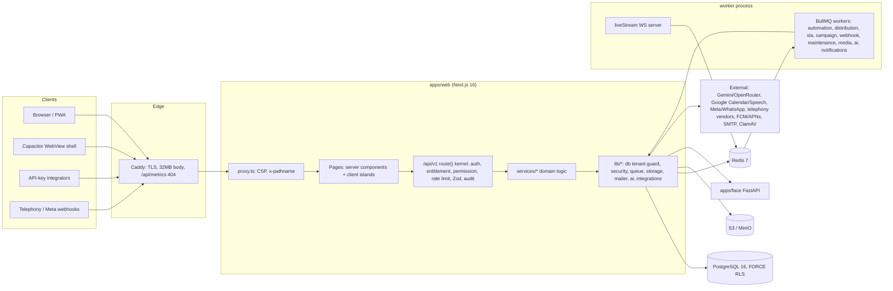

# System Overview

Current observed state, 2026-09-07. Evidence levels as defined in
`docs/SYSTEM_INVENTORY.md`.

## Purpose

YOUHAN ONE is a multi-tenant SaaS: a Platform Owner creates and manages
workspaces (companies); each workspace runs a Sales CRM and/or an HRMS module
under one canonical tenant id. VERIFIED — `README.md` (product hierarchy) is
matched by `Tenant`, `WorkspaceMembership`, `ModuleEntitlement`,
`SubscriptionPlan` in `prisma/schema.prisma` and by `src/lib/security/
entitlements.ts` (`ProductModule = 'HRMS' | 'SALES'`).

## High-level architecture

One Next.js application serves the UI (server components + client islands),
the JSON API (`/api/v1`) and the operational endpoints (`/api/health`,
`/api/metrics`). A second process of the same codebase runs BullMQ workers
(`PROCESS_ROLE=worker`). PostgreSQL holds all tenant data behind row-level
security; Redis carries queues, rate-limit counters, actor/entitlement cache
and pub/sub for live call streams; an S3-compatible bucket holds files. A
Python sidecar does face recognition. Caddy terminates TLS in front of the web
container. VERIFIED — `src/app`, `src/workers/index.ts`, `src/lib/db.ts`,
`src/lib/redis.ts`, `src/lib/storage.ts`, `apps/face/main.py`,
`infra/Caddyfile`, `infra/docker-compose*.yml`.

## Major components

| Component | Role | Evidence |
|---|---|---|
| `src/proxy.ts` | Next 16 proxy (middleware): builds a per-request CSP, forwards `x-pathname`; matcher excludes static assets and prefetches | E1 |
| `src/lib/api/handler.ts` `route()` | The request pipeline for 136 routes: request id, credential resolution (session / `lf_live_` API key / `lf_svc_` service credential), rate limits, entitlement, permission, Zod parsing, audit, RFC 9457 errors | E1 |
| `src/lib/api/guarded.ts` | A second wrapper used by 10 routes (prologue-only guard) | E1; E3 `tests/security/guarded-prologue` |
| `src/services/*` | Domain services taking `Ctx` (tenant + actor + permissions) | E1 |
| `src/lib/db.ts` | Prisma client with adapter, tenant guard extension that refuses tenant-table queries without a tenant filter, pins `app.tenant_id` per transaction, `prismaRead` replica handle | E1 |
| `src/lib/security/*` | RBAC scopes, visibility, field security, entitlements, rate limiting, origin checks, audit, envelope encryption, outbound URL guard, CIDR trust | E1 |
| `src/lib/queue.ts` + `src/workers/*` | 9 BullMQ queues with per-queue retry policy; schedulers | E1 |
| `src/lib/env.ts` + `src/lib/startup-check.ts` | Config schema; production boot gate (env axis vs DB name, role attributes, unforced RLS tables, same-URL refusal) | E1 |
| `infra/*` | Dockerfile, Compose base + overlays, Caddy, systemd, Prometheus/Alertmanager | E2 |
| `.github/workflows/*` | CI gate, manual deploy, manual image build | E2 |

## Request / data flow (summary)

Browser → Caddy → Next (proxy CSP) → page (server component calls
`requestCtx()` → `resolveCtx()`; redirects to `/login` or MFA enrolment) or
API (`route()` → service → Prisma with tenant pinned → audit → problem+json on
error). Background work is enqueued (`enqueue()`) and executed by the worker
process against the same services. Detail: `docs/architecture/DATA_FLOW.md`.
VERIFIED — `src/lib/workspace-page.ts`, `src/lib/auth/session.ts`,
`src/lib/api/handler.ts`, `src/lib/queue.ts`.

## Trust boundaries (as visible in code/config)

1. Internet ↔ Caddy (TLS, body limit, `/api/metrics` hidden). E2.
2. Caddy ↔ web container (`X-Real-IP`; `TRUSTED_PROXY_CIDRS` in `env.ts`,
   `clientIp()` in `session.ts`). E1/E2.
3. Unauthenticated ↔ authenticated: `resolveCtx`/`authenticateApiKey`/
   `requirePlatformServiceActor` in the kernel. E1.
4. Tenant ↔ tenant: three layers — application filter via `Ctx`, Prisma
   tenant guard, PostgreSQL RLS with `app.tenant_id`. E1; E3 `tests/tenant/*`.
5. Workspace ↔ platform console: `PlatformRole`, MFA mandatory for privileged
   roles, time-boxed `PlatformAccessGrant` for support entry. E1.
6. App ↔ third parties: outbound URL private-address guard, signed inbound
   webhooks, envelope-encrypted stored credentials. E1.
7. Compose bridge network: services speak plaintext to each other on one host
   (`docs/KNOWN-LIMITATIONS.md`). E4.

## Runtime / deployment shape

DOCUMENTED and matched by executable configuration: one Azure Ubuntu VM
running a Compose project per environment (`production`, `staging`), images
tagged by commit via `scripts/release.sh`, Caddy on 80/443 (production) or
`:8080` (staging), Postgres/Redis/MinIO/ClamAV/face/Prometheus/Alertmanager as
containers, systemd timers for backups. Whether that VM, those containers and
those timers are currently live: `UNKNOWN — requires runtime/infrastructure
verification`.

## Major dependencies

Runtime: Node ≥22 (24 in CI, 22-alpine in containers), PostgreSQL 16, Redis 7,
MinIO (S3 API), Caddy 2, Python 3.12 (face). Libraries: Next 16.2.12, React
19.2.8, Prisma 7.10.0, Zod 3.25.76, BullMQ 5.81.2, ioredis 5.11.1, pino
9.14.0, `@node-rs/argon2` 2.0.2, `@aws-sdk/client-s3` 3.x, nodemailer 9,
`ws` 8, Tailwind 4.3.3; tooling Vitest 4.1.10, Playwright 1.62, ESLint 9,
Prettier 3.9.6, TypeScript 5.9.3. E2 `package.json` / installed versions.

## Conflicts recorded

Full records in `docs/EVIDENCE_CONFLICTS.md`.

- **EVC-001** — `apps/web/docs/00-ARCHITECTURE.md` §2 layering (routes never
  import prisma; a repository layer; `actions.ts` server actions) is not the
  current code (136 route files import `@/lib/db`; no `src/repositories`; 0
  `actions.ts`).
- **EVC-002** — §5 of the same document names queues and concurrencies that
  differ from `src/lib/queue.ts` / `src/workers/*`.
- **EVC-003** — `docs/DEPLOYMENT.md` (15 lines, 2026-08-05) says the launcher
  is local-only; `docs/DEPLOY-AZURE.md` (2026-08-21) and `scripts/release.sh`
  describe the current mechanism.

## Evidence Sources

E1: `apps/web/src/proxy.ts`, `src/lib/api/handler.ts`, `src/lib/db.ts`,
`src/lib/auth/session.ts`, `src/lib/security/*`, `src/lib/queue.ts`,
`src/workers/index.ts`, `src/lib/env.ts`, `src/lib/startup-check.ts`,
`src/services/*`, `apps/face/main.py`.
E2: `apps/web/package.json`, `next.config.ts`, `infra/Dockerfile`,
`infra/docker-compose*.yml`, `infra/Caddyfile*`, `infra/systemd/*`,
`.github/workflows/*.yml`.
E3: `apps/web/tests/tenant/*`, `tests/security/*`.
E4: `README.md`, `apps/web/README.md`, `apps/web/docs/00-ARCHITECTURE.md`,
`docs/DEPLOY-AZURE.md`, `docs/KNOWN-LIMITATIONS.md`.
Unverified: live VM topology, DNS, TLS issuance status, which overlays are
active, whether the worker/face/clamav containers are running.
